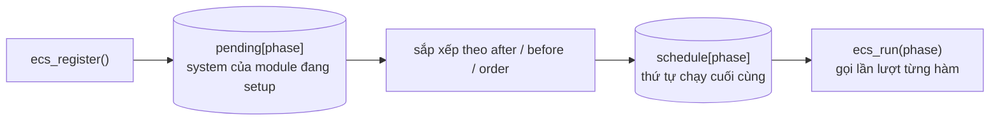

# Kiến trúc bên trong {#architecture}

Trang này dành cho người muốn hiểu hoặc sửa engine. Nếu chỉ muốn làm game, bạn không cần đọc.

## Hai lớp

```
src/engine/
  api/       header công khai, chỉ có khai báo. Game include njin.h
  runtime/   phần cài đặt. Dùng raylib. Game không thấy
```

**raylib bị giấu hoàn toàn**: header trong `api/` không include raylib. Các hàm
`to_raylib` và `from_raylib` (file `njin2rl` và `rl2njin`) đổi qua lại giữa kiểu
của njin (`vec2`, `rgba`...) và kiểu của raylib. Nhờ vậy game chỉ phụ thuộc vào
`njin::api`, còn raylib là chi tiết cài đặt của `njin::rt`.

## njin_ctx

njin::njin_ctx là một struct **mờ** với game: chỉ dùng qua các hàm. Định nghĩa thật
nằm trong `runtime/njin_ctx_impl.h`:

| Thành viên | Vai trò |
|---|---|
| `cfg` | Cấu hình đã truyền vào njin_create() |
| `time` | Thời gian, tốc độ, tạm dừng, bộ tích lũy fixed update |
| `random` | Bộ sinh số ngẫu nhiên dùng chung |
| `window` | Mở cửa sổ và thiết bị âm thanh khi tạo, đóng khi hủy |
| `input` | Trạng thái phím của frame trước và frame này, danh sách action |
| `shader`, `texture`, `render_texture` | Các store tài nguyên GPU |
| `font` | Store font |
| `audio` | Store âm thanh: sound và music |
| `post` | Ảnh ngoài màn hình của shader hậu kỳ (module camera) |
| `sprites` | Ảnh đã bake của các chunk tilemap (module sprite) |
| `scene` | Danh sách scene, scene hiện tại và yêu cầu chuyển |
| `ecs` | Registry, dispatcher và lịch chạy system |

Thứ tự khai báo quan trọng: thành viên bị hủy theo thứ tự **ngược**, và `window`
được khai báo trước các store, nên nó đóng **sau cùng**. Các store giải phóng tài
nguyên GPU và bộ đệm âm thanh trong lúc OpenGL context và thiết bị âm thanh còn sống. Thiết
bị âm thanh được mở cùng cửa sổ và đóng trong destructor của `window`.

## Store và handle

`shader_store`, `texture_store`, `render_texture_store` và `audio_store` cùng một khuôn:

- Mỗi tài nguyên nằm trong một **slot** của một `std::vector`.
- Handle có `id = chỉ số slot + 1`. Nên `id == 0` luôn là không hợp lệ.
- Slot **không bao giờ được tái sử dụng** sau khi unload. Handle cũ vì thế không thể trỏ nhầm sang tài nguyên mới.
- Destructor của store giải phóng mọi slot còn sống.
- Store không copy được, vì copy sẽ giải phóng cùng một tài nguyên GPU hai lần.

## Lịch chạy system



`ecs_store` (file `runtime/njin_ecs.h`) giữ hai mảng theo phase:

- `pending`: system của module **đang** chạy `setup`.
- `schedule`: thứ tự cuối cùng của mọi module đã đăng ký.

Khi njin_mod_register() được gọi:

1. Bật cờ `in_setup` để ecs_register() biết nó đang được gọi hợp lệ.
2. Gọi `setup` của module. Mỗi ecs_register() đẩy vào `pending[phase]`.
3. Với mỗi phase, sắp xếp `pending` rồi **nối vào cuối** `schedule`, sau đó xóa `pending`.

Vì bước 3 nối vào cuối nên module đăng ký trước chạy trước.

**Sắp xếp** là sắp xếp topo: lấy các system chưa bị ràng buộc `after`/`before`
chặn, chọn cái có `order` nhỏ nhất (bằng nhau thì theo thứ tự đăng ký), đặt nó vào
kết quả, gỡ ràng buộc của nó, lặp lại. Nếu còn system mà không cái nào chọn được thì có vòng phụ thuộc: ghi lỗi
và nối số còn lại theo thứ tự đăng ký.

`ecs_run(phase)` chỉ là một vòng `for` gọi từng hàm trong `schedule[phase]`.

## Module lõi

njin_create() đăng ký sẵn các module lõi trước khi trả về, trong `runtime/modules/`,
theo thứ tự:

| Module | Việc làm |
|---|---|
| `njin.reload` | Nạp lại texture, shader có file vừa đổi, khi hot reload bật (xem @ref rendering) |
| `njin.debug` | Khi bật cổng debug: nhận lệnh của njin_inspector ở đầu frame, gửi số liệu ở cuối (xem @ref debug) |
| `njin.ui` | Đọc phím, chuột, tay cầm cho UI, chuyển lựa chọn, giữ phím điều hướng khi menu hiện, chặn widget phía sau popup; toast được vẽ ở cuối frame (xem @ref ui) |
| `njin.camera` | Bật camera (có rung) trước mọi lệnh vẽ; chạy post-processing (xem @ref camera, @ref post_processing) |
| `njin.audio` | Cấp dữ liệu cho stream nhạc, phát lại sound lặp (xem @ref audio) |
| `njin.hierarchy` | Tính transform của entity con từ cha (xem @ref prefabs) |
| `njin.anim` | Chạy njin::animator: chuyển trạng thái, đổi frame (xem @ref animation) |
| `njin.particles` | Sinh, di chuyển, xóa hạt (xem @ref particles) |
| `njin.sprite` | Chạy njin::sprite_anim, nháy sprite, bake chunk tilemap, vẽ sprite, tilemap và particle theo lớp (xem @ref sprites, @ref tilemap) |
| `njin.collision` | Tìm cặp collider chạm nhau, gửi event; vẽ khung khi bật dò lỗi (xem @ref collision) |

Vì chúng đăng ký **trước** module của game nên system của chúng chạy trước trong cùng
phase. Module camera dựa vào điều này để bật camera trước mọi lệnh vẽ của game;
hierarchy chạy trước anim, particle và sprite để chúng thấy vị trí mới của frame này.

## Thêm một module lõi

1. Tạo `runtime/modules/<tên>.cpp` và `.h`, khai báo một hàm trả về njin::mod_desc.
2. Gọi njin_mod_register() cho nó trong `register_core_modules()` (`runtime/modules/core_modules.cpp`).

CMake tự tìm mọi file `.cpp` dưới `runtime/`, không cần sửa danh sách file.
