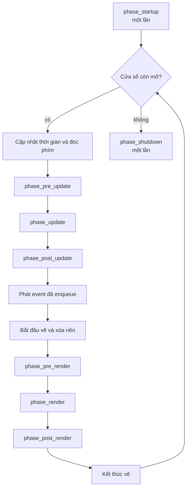

# Vòng lặp game {#game_loop}

njin_run() chạy vòng lặp sau:

## Đầu mỗi frame

Trước phase đầu tiên, engine:

1. Cập nhật thời gian: delta() là thời gian của frame trước, elapsed() là thời
   gian từ lúc mở cửa sổ (cả hai tính bằng giây).
2. Đọc trạng thái phím (xem @ref input). Trạng thái này **không đổi** trong suốt frame.

## Nhóm update

`phase_pre_update`, `phase_update`, `phase_post_update` là nơi đặt logic. Cách
chia thông thường:

- **pre_update**: đọc input, chuẩn bị dữ liệu
- **update**: logic chính, di chuyển, va chạm
- **post_update**: việc phụ thuộc kết quả của update, ví dụ camera đi theo người chơi

Ngay sau `phase_post_update`, các event đã xếp hàng bằng `events(ctx).enqueue`
được phát (xem @ref ecs).

## Nhóm render

`phase_pre_render`, `phase_render`, `phase_post_render` chạy giữa lúc bắt đầu và
kết thúc vẽ. Module camera của engine chia chúng thành hai không gian:

| Phase | Không gian | Chịu ảnh hưởng của camera |
|---|---|---|
| `phase_pre_render` | Thế giới | Có |
| `phase_render` | Thế giới | Có |
| `phase_post_render` | Màn hình | Không |

Vì vậy: vẽ nhân vật, bản đồ ở `phase_render`; vẽ UI ở `phase_post_render` để nó
không bị camera dịch chuyển hay phóng to. Xem @ref camera.

## Startup và shutdown

- `phase_startup` chạy **một lần**, sau khi cửa sổ đã mở và trước frame đầu tiên. Đây là nơi
  tạo entity, nạp texture, shader và gắn phím.
- `phase_shutdown` chạy **một lần** sau khi cửa sổ đóng.

Tài nguyên (texture, shader, render texture) được giải phóng tự động khi gọi
njin_destroy(), bạn không bắt buộc phải unload trong `phase_shutdown`.
