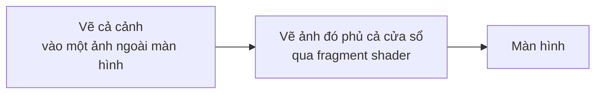

# Bài 11: Các mẫu shader hay gặp {#learn_shader_patterns}

**Bài này dạy gì:** những mẫu shader mà game 2D dùng nhiều nhất: hậu kỳ (viền tối, sọc CRT, làm mờ), nháy
trắng, đổi bảng màu, tan biến, viền quanh nhân vật, giữ pixel art sắc nét, sóng gợn; cùng cách chúng ứng với
những gì njin đã có sẵn, và vài quy tắc thực tế để viết shader nhỏ, đúng và rẻ.

**Cần biết trước:** @ref learn_shader_start : GLSL cơ bản, uniform, và cách chạy sân chơi
(`learn_shader_playground.c`). Mọi ví dụ ở đây chạy trong sân chơi đó; phím chế độ ghi ở đầu mỗi ví dụ.

## Hai chỗ shader chạy

Có hai kiểu dùng, khác nhau ở **thứ shader nhìn thấy trong `texture0`**:

| Kiểu | `texture0` là | Sân chơi | Dùng cho |
|---|---|---|---|
| Lên một sprite | Ảnh của sprite đó | Chế độ 2 | Nháy trắng, viền, tan biến, đổi màu nhân vật |
| Lên cả cảnh | Cả khung hình đã vẽ xong | Chế độ 3 | Viền tối, CRT, làm mờ, pixel hoá cả màn hình |

### Vì sao hậu kỳ phải vẽ cảnh vào ảnh trước

GPU vẽ từng vật một vào khung hình; khi vẽ một vật, shader chỉ biết dữ liệu của **vật đó**. Không có cách nào để một
shader "nhìn" cả cảnh đã vẽ rồi để làm mờ hay tối viền. Cách làm:

Lúc này `texture0` **là** cả cảnh, nên shader đọc được màu của bất kỳ điểm nào, kể cả điểm bên cạnh. Chế độ 3
của sân chơi làm đúng việc này: vẽ cảnh vào một ảnh ngoài màn hình, rồi vẽ ảnh đó qua shader. Vì ảnh ngoài màn
hình lưu ngược chiều dọc, sân chơi vẽ nó với chiều cao **âm** (xem dòng `-450` trong mã).

## Hậu kỳ

### Viền tối (vignette)

@include learn_shader_vignette.fs

@image html learn_shader_vignette.png "Chế độ 3. Trái: cảnh gốc. Phải: viền tối, đậm 70% (mouse.x = 0.7). Tối ở bốn góc, giữa giữ nguyên."

`distance(fragTexCoord, vec2(0.5))` là khoảng cách tới tâm: 0 ở giữa, khoảng 0.7 ở góc. `1.0 - smoothstep(0.30, 0.80, d)`
cho 1 ở giữa và giảm dần ra rìa; nhân vào màu cảnh thì rìa tối đi. `mix(1.0, light, mouse.x)` là "núm vặn": 0 là
không tối, 1 là tối hết cỡ.

### Sọc ngang và nhuộm màu (kiểu CRT)

@include learn_shader_scanlines.fs

@image html learn_shader_scanlines.png "Chế độ 3, cắt sát quanh nhân vật và phóng to. Trái: gốc. Phải: xám nhuộm xanh lục và sọc ngang như màn hình đơn sắc kiểu cũ."

Hai bước ghép: đổi sang xám (`dot`), nhân với một màu (`vec3(0.4, 1.0, 0.5)`) để nhuộm; rồi nhân một hệ số
`0.85 + 0.15 * sin(row * 3.14159)` thay đổi theo **hàng pixel** (`fragTexCoord.y * resolution.y`) cho ra sọc: cứ hai
hàng, một hàng tối nhẹ. Cần `resolution` để đổi toạ độ 0 đến 1 về số hàng thật.

### Làm mờ

@include learn_shader_blur.fs

@image html learn_shader_blur.png "Chế độ 3, cắt quanh nhân vật và phóng to. Trái: gốc. Phải: sau khi làm mờ với bán kính khoảng 4 pixel (mouse.x = 0.7)."

Ý tưởng: màu mới là **trung bình** của các pixel xung quanh. Ở đây là lưới 3 x 3 (9 lần đọc ảnh), cách nhau
`radius` pixel; `texel = 1.0 / resolution` là "một pixel" tính theo toạ độ ảnh, để nhân với số pixel muốn nhảy.

Một lỗi thật mình gặp khi viết bài này: bản đầu **không có dòng `clamp`**, và ở mép trên, mép dưới của khung có một dải
màu lạ (màu đất lẫn vào bầu trời). Nguyên nhân là pixel ở mép cần đọc "ngoài ảnh", mà raylib mặc định **lặp ảnh**,
nên nó lấy nhầm màu từ mép **đối diện**. Sửa bằng `clamp` để giữ toạ độ trong ảnh. Nhưng `clamp(..., 0.0, 1.0)` vẫn chưa đủ: đọc
đúng vào `0.0` hay `1.0` mà bộ lọc mượt (bilinear) thì vẫn pha với mép bên kia; phải chừa **nửa pixel**:
`clamp(p, texel * 0.5, 1.0 - texel * 0.5)`. Đã thử cả hai cách và đo màu ở mép: chỉ cách chừa nửa pixel cho đúng
màu như ảnh gốc.

**Chi phí.** Mỗi pixel đọc 9 lần. Bán kính lớn hơn nghĩa là phải đọc nhiều điểm hơn, hoặc nhảy xa hơn và thấy các "bậc" rõ
hơn. Cách phổ biến là **tách thành hai lượt**: một lượt làm mờ ngang, một lượt làm mờ dọc. Mờ ngang 3 điểm rồi
mờ dọc 3 điểm cho cùng kết quả như lưới 3 x 3 nhưng chỉ tốn `3 + 3 = 6` lần đọc thay vì `3 x 3 = 9`; bán kính
càng lớn thì lợi càng nhiều (lưới `n x n` tốn `n * n`, hai lượt tốn `2 * n`). njin làm mờ theo cách này:
mỗi lượt là một phía của bộ lọc Gaussian 9 điểm, và bản mờ lớn chạy ở **nửa độ phân giải** (chỉ chạm một phần tư
số pixel), xem @ref post_processing.

### Vì sao gộp thành một lượt

Vignette, sọc và nhuộm màu đều chỉ cần **pixel hiện tại**, nên gộp vào cùng một shader và vẽ **một lần**:

@include learn_shader_answer_crt.fs

Một lượt vẽ toàn màn hình có giá, tính theo số pixel. Ba shader nối nhau tốn ba lượt; gộp lại tốn một. Đó là lý do
njin gộp gần hết hiệu ứng vào một shader ("uber shader") và chỉ tách riêng blur và bloom, những hiệu ứng cần đọc
pixel bên cạnh. Đây cũng là bài tập 1 ở cuối bài.

## Lên một sprite

### Nháy trắng khi trúng đòn

@include learn_shader_flash.fs

@image html learn_shader_flash.png "Chế độ 2. Trái: nhân vật gốc. Phải: nháy trắng 70%. Hình dáng giữ nguyên, nền vẫn trong suốt."

Trộn màu pixel về trắng, **giữ nguyên alpha**: phần trong suốt vẫn trong suốt, nên sprite sáng lên đúng theo hình dáng nó. Chú
ý đây là `mix` chứ không phải phép nhân: nhân với màu cho ra màu **tối hơn hoặc bằng** màu gốc (vì mỗi kênh của
màu nhân từ 0 đến 1), không bao giờ làm một sprite sáng lên thành trắng được.

### Đổi bảng màu theo độ sáng

@include learn_shader_palette.fs

@image html learn_shader_palette.png "Chế độ 2. Trái: gốc. Phải: sau khi ánh xạ độ sáng qua bảng ba màu tối, hồng, kem."

Tính độ sáng của pixel gốc rồi dùng nó làm chỉ số vào một **bảng màu** viết bằng `mix`. Tối, vừa, sáng thành ba màu bạn chọn. Cách này
hợp để đổi phong cách một sprite (ban đêm, trúng độc, đóng băng) mà không cần vẽ thêm ảnh. Nó không phải hoán đổi
bảng màu theo *chỉ số* như game 8-bit thật (mỗi pixel là một số, tra vào một bảng), nhưng cùng ý tưởng, và đủ
cho phần lớn nhu cầu.

### Tan biến

@include learn_shader_dissolve.fs

@image html learn_shader_dissolve.png "Chế độ 2. Trái: gốc. Phải: đang tan biến, khoảng ba phần tư số pixel đã mất, mép còn lại sáng màu cam."

Mỗi pixel của ảnh gốc được gán một số ngẫu nhiên cố định bằng hàm `hash`; đó là mẹo phổ biến: `fract(sin(dot(p, vec2(12.9898, 78.233))) * 43758.5453)`
cho số trong khoảng 0 đến 1 mà cùng đầu vào luôn ra cùng kết quả (njin cũng dùng đúng hàm này cho nhiễu hạt
của hậu kỳ). Toạ độ được làm tròn về ô pixel (`floor(fragTexCoord * textureSize(...))`) để các mảnh vuông vức, khớp
lưới pixel art. Rồi so số đó với một **ngưỡng** `t`: nhỏ hơn thì `discard` (bỏ pixel, không vẽ). Tăng ngưỡng từ 0 lên
1 là ảnh tan dần. Dải hẹp ngay trên ngưỡng được tô màu cam để giống cháy.

Thay `n = hash(cell)` bằng một đại lượng khác cho ra kiểu tan khác: dùng vị trí thì tan theo hướng (bài tập 3).

### Viền quanh nhân vật

@include learn_shader_outline.fs

@image html learn_shader_outline.png "Chế độ 2. Trái: gốc. Phải: có viền vàng dày một pixel của ảnh gốc, ôm cả mũ và hai chân."

Với mỗi pixel, đọc độ đục của 4 pixel kề. Nếu pixel **hiện tại trong suốt** nhưng có hàng xóm **đục**, nó nằm ngay ngoài
mép: tô màu viền. Chú ý: vì hình chỉ được vẽ trong khung ảnh, phải chừa **lề trong suốt** quanh nhân vật ít nhất một pixel,
nếu không những pixel nằm ngoài khung sẽ không bao giờ được shader chạy để tô viền, và viền bị cắt ở mép ảnh.

### Giữ pixel art sắc nét, và pixel hoá

Ảnh pixel art phóng to phải giữ từng pixel vuông vức. Cách thường là chọn bộ lọc **điểm** (nearest); nhưng khi ảnh được
vẽ bằng bộ lọc **mượt** (bilinear), hoặc bị xoay, hoặc nằm ở toạ độ lẻ, cạnh bị nhoè. Shader sửa được:

@include learn_shader_crisp.fs

@image html learn_shader_crisp.png "Chế độ 2 với bộ lọc mượt. Trái: nhoè cạnh khi phóng. Phải: cùng bộ lọc nhưng có shader này, cạnh sắc."

Toạ độ `fragTexCoord` được làm tròn về **tâm** của một pixel gốc: `(floor(uv * size) + 0.5) / size`. Mỗi lần đọc rơi đúng
giữa một pixel, nên bộ lọc mượt không còn gì để trộn.

Khác với thế, **pixel hoá** làm ảnh thô đi có chủ ý (cho cảnh cũ, hoặc hiệu ứng trúng đòn), bằng cùng công thức nhưng với ô **lớn hơn**
pixel gốc:

@include learn_shader_pixel.fs

@image html learn_shader_pixel.png "Chế độ 3. Trái: cảnh gốc. Phải: pixel hoá với ô 14 pixel (mouse.x = 0.7)."

`resolution / size` là số ô theo mỗi chiều; làm tròn xuống ô rồi lấy mẫu ở tâm ô: mọi pixel trong một ô nhìn thấy cùng một màu.

### Sóng gợn

@include learn_shader_wave.fs

@image html learn_shader_wave.png "Chế độ 3. Trái: cảnh gốc. Phải: bị uốn theo sóng ngang, chụp ở một thời điểm cố định."

Dịch **toạ độ đọc**, không dịch màu: lấy màu ở chỗ cách một chút về bên phải hay bên trái. Độ dịch là một sóng `sin`
theo `uv.y` chạy theo `time`, nên cả cảnh lượn như dưới nước hoặc trong nóng. Mọi hiệu ứng "bẻ cong"
(nước, nhiệt, chấn động) là biến thể của mẹo này: **tính lại toạ độ, rồi đọc ảnh**.

### Hiện một số thành màu để gỡ lỗi

@include learn_shader_debug.fs

@image html learn_shader_debug.png "Chế độ 2. Trái: nhân vật. Phải: độ đục thành màu xám. Trắng là đục hẳn, đen là trong suốt; khung vuông đen là cả ảnh."

Khi viền không hiện, hay tan biến trông sai, bước đầu tiên là **xem chính con số**. Shader này cho thấy kênh alpha; nhìn là biết
"pixel này có thật sự trong suốt không" và "khung ảnh có chừa lề không" (vùng đen quanh nhân vật chính là lề). Cùng cách đó
cho mọi thứ: `finalColor = vec4(vec3(x), 1.0)` hiện `x` thành xám; `vec4(uv, 0.0, 1.0)` hiện toạ độ, như bài trước.

## Trong njin

njin có sẵn những thứ này. Bảng ánh xạ, đã đối chiếu với header và mã nguồn:

| Mẫu ở bài này | Trong njin |
|---|---|
| Viền tối, sọc CRT, pixel hoá, làm mờ, nhuộm màu, nhiễu hạt... | njin::post_fx_set() với njin::post_fx: các trường `vignette`, `scanlines` và `scanline_size`, `pixelate`, `blur`, `tint`, `saturation`, `grain`... Không phải viết shader. Xem @ref post_processing |
| Gộp nhiều hiệu ứng vào một lượt | Đã làm sẵn: các hiệu ứng chỉ cần pixel hiện tại gộp trong một shader, `blur` và `bloom` là lượt riêng (header `njin_post.h`) |
| Shader hậu kỳ của riêng bạn | njin::camera_set_post_shader(): vẽ cả thế giới qua shader đó, **sau cùng** trong chuỗi hiệu ứng có sẵn. UI trong `phase_post_render` không bị ảnh hưởng |
| Tan biến sprite | njin::sprite_dissolve() và njin::dissolve_fx: cùng ý với `learn_shader_dissolve.fs` ở bài này (ngưỡng nhiễu quét từ 0 đến 1, viền cháy ở mép), nhưng số ngẫu nhiên tính bằng hàm băm nên không cần ảnh nhiễu. Xem @ref particles |
| Nháy trắng sprite | njin::sprite_flash(). Shader của nó (`flash_fs` trong `fx.cpp`) làm đúng điều ở bài này: `mix(c.rgb, flashColor.rgb, flashColor.a)`, giữ `c.a` |
| Shader của riêng bạn lên sprite hay vật | njin::shader_load(), njin::shader_set_f32(), njin::shader_set_vec2(), rồi njin::shader_begin() và njin::shader_end() bao quanh lệnh vẽ. Đặt uniform **trước** `shader_begin` |
| Sửa shader khi game chạy | njin::hot_reload_enable(). Shader **lỗi biên dịch thì giữ bản cũ** và ghi log, giống sân chơi. Nên bật ở bản debug |

Vì njin và sân chơi cùng dùng GLSL 330 và cùng tên do raylib quy định (`fragTexCoord`, `texture0`,
`colDiffuse`), **file shader không cần sửa**. Điều khác duy nhất: các uniform mà sân chơi tự đưa vào (`time`,
`resolution`, `mouse`) giờ bạn phải tự đặt bằng njin::shader_set_f32() và njin::shader_set_vec2(). Đã thử: nạp nguyên
xi `learn_shader_vignette.fs` bằng njin::shader_load(), đặt `mouse` bằng njin::shader_set_vec2(), rồi bật bằng
njin::camera_set_post_shader(): viền tối hiện ra ở bốn góc cảnh.

## Lời khuyên thực tế

- **Mỗi shader một việc, và ngắn.** Shader ngắn dễ đọc, dễ gỡ lỗi, và chạy rẻ. Cần ba hiệu ứng thì gộp trong một
  shader nếu chúng chỉ cần pixel hiện tại (như bài tập 1), tách nếu cần đọc pixel bên cạnh.
- **Ưu tiên `mix`, `step`, `smoothstep`, `clamp` hơn `if`.** GPU chạy nhiều pixel cùng lúc theo nhóm; khi các pixel trong một
  nhóm rẽ sang hai nhánh khác nhau, GPU thường phải chạy cả hai nhánh. Thay vì `if (x > 0.5) c = a; else c = b;`, viết
  `c = mix(b, a, step(0.5, x));`. Bài tập 2 là một ví dụ (`step` làm công tắc).
- **Chi phí tăng theo số pixel bị phủ và số lần đọc ảnh.** Một shader lên toàn màn hình chạy cho mọi pixel; lên một sprite nhỏ
  chỉ cho các pixel của sprite. Mỗi lần `texture()` thêm vào là một lần đọc bộ nhớ cho **từng pixel**: bán kính blur, số
  điểm lấy mẫu là thứ nên cân nhắc đầu tiên.
- **Mỗi núm vặn một uniform, đặt tên rõ.** `amount`, `radius`, `time`. Đừng nhồi hai ý nghĩa vào một `vec4`. Uniform đổi mỗi frame phải
  được đặt lại mỗi frame.
- **Giữ alpha khi chỉ đổi màu.** Trả về `vec4(rgb, c.a)`. Quên là phần trong suốt của sprite thành đục (hoặc đen).
- **Coi chừng mép ảnh.** Đọc ra ngoài 0 đến 1 thì raylib lặp ảnh; xem mục làm mờ ở trên về `clamp` và nửa pixel.
- **Gỡ lỗi bằng cách hiện thành màu**, như shader `learn_shader_debug.fs`.
- **Thử trên card đồ họa yếu nếu có** (card onboard). Card yếu lộ chi phí sớm nhất: một hiệu ứng chạy êm ở card rời có thể
  làm khựng ở card onboard, và bạn thấy nó trước khi người chơi thấy. Toàn bộ ảnh chụp trong hai bài này là từ một card
  onboard (Intel Iris Xe).
- **Đừng tin vào một driver duy nhất.** Thông báo lỗi và cách xử lý vài chỗ mơ hồ của GLSL khác nhau giữa các hãng
  (xem bài trước: thông báo lỗi ở đó là của Intel). Giữ shader gần với chuẩn: viết `1.0`, không lạm dụng
  hành vi không xác định (như `smoothstep` với đối số ngược).

## Tự kiểm tra

1. Vì sao hiệu ứng toàn màn hình phải vẽ cả cảnh vào một ảnh ngoài màn hình trước, rồi mới vẽ ảnh đó qua shader?
2. Vì sao "nháy trắng" dùng `mix` về trắng mà không dùng phép nhân màu?
3. Trong shader viền, vì sao điều kiện là "pixel hiện tại trong suốt **và** có hàng xóm đục", chứ không chỉ "có hàng xóm đục"?
4. `learn_shader_crisp.fs` và `learn_shader_pixel.fs` cùng làm tròn toạ độ. Khác nhau ở đâu, và dùng mỗi cái khi nào?
5. `clamp(p, 0.0, 1.0)` vẫn để lại dải màu lạ ở mép khi làm mờ. Vì sao, và sửa thế nào?

## Bài tập

1. Viết **một shader** (chế độ 3) gồm vignette và sọc ngang, không nhuộm màu. Vì sao gộp lại là hợp lý?
2. Làm cho nháy trắng **tự chớp** 4 lần mỗi giây theo `time`, không dùng `if`.
3. Sửa `learn_shader_dissolve.fs` để nhân vật tan **từ trên xuống**: đầu tan trước, chân tan sau.

## Đáp án

**Tự kiểm tra.**

1. Khi vẽ một vật, shader chỉ thấy dữ liệu của vật đó. Vẽ cảnh vào ảnh trước thì `texture0` là cả cảnh,
   shader đọc được màu bất kỳ điểm nào, kể cả điểm bên cạnh (cần cho làm mờ, và cho mọi hiệu ứng lên "cả khung hình").
2. Màu nhân có các kênh trong khoảng 0 đến 1, nên phép nhân chỉ giữ hoặc làm tối màu gốc, không thể làm một màu cam thành trắng.
   `mix(c.rgb, vec3(1.0), t)` kéo màu về trắng.
3. Nếu chỉ kiểm tra hàng xóm đục, cả các pixel **bên trong** nhân vật cũng có hàng xóm đục và bị tô viền. Điều kiện
   "chính nó trong suốt" giới hạn viền ở ngoài mép.
4. Cả hai làm tròn toạ độ về tâm ô. `crisp` dùng ô **bằng một pixel gốc** để giữ ảnh sắc nét khi bị lọc mượt hoặc phóng to;
   `pixelate` dùng ô **lớn hơn** để cố ý làm thô ảnh. Dùng `crisp` để chữa nhoè, `pixelate` để tạo hiệu ứng.
5. Đọc đúng vào `0.0` hay `1.0` với bộ lọc mượt và chế độ lặp thì bộ lọc vẫn pha điểm mép với điểm ở mép bên kia.
   Sửa: chừa nửa pixel, `clamp(p, texel * 0.5, 1.0 - texel * 0.5)`.

**Bài tập 1: vignette và sọc trong một lượt.**

@include learn_shader_answer_crt.fs

Cả hai chỉ cần pixel hiện tại, nên nhân chung vào màu trong một shader. Một lượt vẽ toàn màn hình thay vì hai. Chạy chế độ 3: viền tối
ở bốn góc và sọc ngang mảnh trên toàn cảnh.

**Bài tập 2: tự chớp.**

@include learn_shader_answer_blink.fs

`fract(time * 4.0)` chạy từ 0 đến 1 bốn lần mỗi giây; `step(0.5, ...)` biến nó thành tín hiệu 0 rồi 1 xen kẽ. Chụp hai khung ở hai thời điểm khác
nhau, pixel giữa thân nhân vật lúc là cam `(240, 150, 50)`, lúc là trắng `(255, 255, 255)`.

**Bài tập 3: tan từ trên xuống.**

@include learn_shader_answer_dissolve_up.fs

Số `n` không còn ngẫu nhiên mà là `fragTexCoord.y`: 0 ở đầu, 1 ở chân. Ngưỡng `t` tăng thì pixel có `n` nhỏ (phía trên) biến mất
trước. Chạy chế độ 2 với `mouse.x = 0.7`: chỉ còn phần chân, với mép cam sáng phía trên phần còn lại.

## Bước tiếp theo

@ref learn_game_patterns : các mẫu thiết kế trong lập trình game (vòng lặp, trạng thái, sự kiện, ECS) và chúng
xuất hiện trong njin thế nào.
