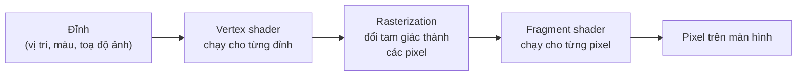

# Bài 10: Shader: làm quen với GLSL {#learn_shader_start}

**Bài này dạy gì:** shader là gì, GPU chạy nó thế nào, ngôn ngữ GLSL đủ dùng, và cách viết, chạy, sửa lỗi
một fragment shader trong một "sân chơi" raylib nhỏ.

**Cần biết trước:** đọc và chạy được một chương trình C đơn giản (@ref learn_c_start) và biết dựng một dự án
CMake có raylib (@ref learn_cmake_projects). Chưa cần biết gì về đồ họa hay toán.

Bài này không dùng njin: chỉ raylib. njin dùng đúng loại shader này, và cuối bài có phần "Trong njin"
cho thấy chúng nối vào engine ở đâu.

## GPU khác CPU chỗ nào

CPU có ít nhân (vài đến vài chục), mỗi nhân làm được mọi thứ, nhanh và linh hoạt. GPU có **rất nhiều đơn vị
tính toán nhỏ** (hàng trăm đến hàng nghìn, tuỳ card), mỗi đơn vị đơn giản hơn nhiều, nhưng chúng chạy **cùng
một chương trình** trên nhiều dữ liệu cùng lúc. Vẽ một khung hình 800 x 450 là 360.000 pixel; không có chuyện một nhân lần lượt tô từng pixel. GPU chia
việc cho các đơn vị của nó, mỗi lần một nhóm pixel được tính màu cùng nhau.

Chương trình nhỏ đó là **shader**. Bạn viết nó một lần; GPU chạy nó cho từng pixel (hoặc từng đỉnh), song
song. Hệ quả cần nhớ ngay:

- Mỗi lần chạy shader chỉ thấy **một pixel** của nó. Nó không biết pixel bên cạnh đang có màu gì, trừ khi
  bạn đọc từ một ảnh (texture).
- Các lần chạy **không nói chuyện với nhau** và không ghi vào nhau. Không có biến chung được sửa dần như
  trong một vòng lặp C.
- Vì vậy shader hay ngắn, và cách nghĩ khác: không phải "duyệt qua từng pixel" mà là "cho một pixel ở vị trí
  này, màu của nó là gì?"

## Đường ống vẽ trong một hình



- Một hình chữ nhật được vẽ là **hai tam giác**, tức 4 đỉnh. Mỗi đỉnh mang vị trí, màu và **toạ độ ảnh**
  (nơi nó nằm trên texture).
- **Vertex shader** chạy cho từng đỉnh, quyết định đỉnh đó nằm ở đâu trên màn hình.
- **Rasterization** (GPU tự làm, bạn không viết) tìm mọi pixel nằm trong tam giác, và **nội suy** dữ liệu
  của ba đỉnh cho từng pixel: một pixel nằm giữa cạnh thì nhận giá trị ở giữa.
- **Fragment shader** (còn gọi pixel shader) chạy cho từng pixel đó và trả về **màu cuối cùng**.

Phần lớn hiệu ứng 2D nằm ở fragment shader, nên bài này chỉ viết loại đó. raylib có sẵn vertex shader mặc
định lo phần còn lại.

## GLSL trong 10 phút

GLSL là ngôn ngữ của shader, gần với C. Đây là shader ngắn nhất có ích:

@include learn_shader_solid.fs

@image html learn_shader_solid.png "Mọi pixel cùng một màu cam: đây là kết quả của learn_shader_solid.fs."

Từng dòng:

| Dòng | Nghĩa |
|---|---|
| `#version 330` | Phiên bản GLSL. raylib và njin trên máy tính dùng 330 (OpenGL 3.3). Phải là dòng đầu tiên |
| `out vec4 finalColor;` | Đầu ra của shader: một màu. `finalColor` là tên tự đặt, chỉ cần có đúng một `out vec4` |
| `void main()` | Chạy một lần cho mỗi pixel |
| `vec4(1.0, 0.5, 0.2, 1.0)` | Màu (đỏ, xanh lục, xanh lam, độ đục). Mỗi số từ 0 đến 1 |

### Kiểu dữ liệu

| Kiểu | Là gì |
|---|---|
| `float`, `int`, `bool` | Số thực, số nguyên, đúng sai. Số thực phải có dấu chấm: `1.0`, không phải `1` |
| `vec2`, `vec3`, `vec4` | Vector 2, 3, 4 số thực: toạ độ, màu |
| `sampler2D` | Một ảnh (texture) để đọc màu từ đó |
| `mat4` | Ma trận 4 x 4. Dùng trong vertex shader để biến đổi vị trí; bài này ít khi cần |

Vector có nhiều cách viết:

@code{.glsl}
vec3 c = vec3(1.0, 0.5, 0.2);
vec4 d = vec4(c, 1.0);       // ghép: vec3 và một số thành vec4
vec3 e = c * 0.5;            // nhân cả ba thành phần với 0.5
vec3 f = c + vec3(0.1);      // vec3(0.1) là cả ba thành phần đều 0.1
float r = c.r;               // lấy một thành phần: .r .g .b .a (hoặc .x .y .z .w)
vec2 g = c.xy;               // lấy hai thành phần đầu: gọi là "swizzle"
vec3 h = c.bgr;              // đảo thứ tự
vec3 k = c.xxx;              // lặp lại một thành phần
@endcode

Phép tính giữa hai vector làm **từng thành phần một**: `a * b` là `vec3(a.x*b.x, a.y*b.y, a.z*b.z)`.

### Hàm có sẵn

Đủ dùng cho hầu hết hiệu ứng:

| Hàm | Làm gì |
|---|---|
| `mix(a, b, t)` | Trộn: `a` khi `t = 0`, `b` khi `t = 1`, ở giữa thì pha. Dùng cho hầu hết mọi thứ |
| `clamp(x, lo, hi)` | Ép `x` vào khoảng `[lo, hi]` |
| `step(edge, x)` | 0 nếu `x < edge`, ngược lại 1. Một "công tắc" không cần `if` |
| `smoothstep(e0, e1, x)` | 0 khi `x <= e0`, 1 khi `x >= e1`, chuyển mượt ở giữa. Yêu cầu `e0 < e1` |
| `length(v)`, `distance(a, b)` | Độ dài vector, khoảng cách hai điểm |
| `dot(a, b)` | Tích vô hướng: nhân từng cặp thành phần rồi cộng lại. Với trọng số `vec3(0.299, 0.587, 0.114)` cho độ sáng của một màu |
| `sin`, `cos` | Sóng. Đầu vào là radian |
| `fract(x)`, `floor(x)` | Phần lẻ, phần nguyên (làm tròn xuống) |
| `min`, `max`, `abs` | Như tên gọi |
| `texture(tex, uv)` | Đọc màu từ ảnh `tex` tại toạ độ `uv` |

### `in`, `out`, `uniform`

| Từ khoá | Nghĩa | Ví dụ |
|---|---|---|
| `in` | Dữ liệu vào từ giai đoạn trước, **khác nhau mỗi pixel** (đã nội suy) | `in vec2 fragTexCoord;` |
| `out` | Kết quả của shader này | `out vec4 finalColor;` |
| `uniform` | Dữ liệu từ chương trình C, **cùng một giá trị cho mọi pixel** trong lần vẽ đó | `uniform float time;` |

raylib gán sẵn vài tên, đặt sai thì shader không nhận dữ liệu:

| Tên | Là gì |
|---|---|
| `fragTexCoord` (`in vec2`) | Toạ độ ảnh của pixel này, nội suy từ các đỉnh |
| `fragColor` (`in vec4`) | Màu nhân của lần vẽ (tham số `tint` của các hàm vẽ) |
| `texture0` (`uniform sampler2D`) | Ảnh đang vẽ |
| `colDiffuse` (`uniform vec4`) | Màu nhân của vật liệu, thường là trắng |

### Những điều khác với C

- Không có đệ quy: hàm không được gọi lại chính nó. Thử viết và bạn sẽ thấy một lỗi *liên kết* (link),
  không phải lỗi biên dịch: xem mục lỗi bên dưới.
- Không có `printf`, không có ghi log. Muốn biết một giá trị là bao nhiêu thì hiện nó thành màu.
- Không có con trỏ, không có cấp phát bộ nhớ. Mảng có kích thước cố định lúc biên dịch.
- Số nguyên và số thực là hai kiểu khác nhau: `1` và `1.0`. Trên card thử, `float x = 1;` vẫn biên dịch
  được, nhưng ở các phiên bản GLSL khác (OpenGL ES) thì không. Luôn viết `1.0` cho số thực.
- Độ chính xác: trên GLSL 330 (máy tính) mọi `float` là 32 bit và không cần khai báo gì. Web và di động dùng
  OpenGL ES, nơi phải khai báo `precision`; njin chỉ nhắm GLSL 330 nên bài này không bàn đến.

## Toạ độ và màu

- **Màu** mỗi kênh từ 0 đến 1, không phải 0 đến 255. `vec3(1.0, 0.5, 0.2)` là cam.
- **Toạ độ ảnh** `fragTexCoord` chạy từ 0 đến 1 trên ảnh đang vẽ. Trong raylib, `(0, 0)` là góc **trên trái**
  của ảnh và `(1, 1)` là góc dưới phải. Thử ngay:

@include learn_shader_gradient.fs

@image html learn_shader_gradient.png "Góc trên trái đen (0, 0), trên phải đỏ, dưới trái xanh lục, dưới phải vàng. Vậy x tăng sang phải, y tăng xuống dưới."

Kênh đỏ theo `x`, kênh xanh lục theo `y`: nhìn màu ở bốn góc là biết hệ toạ độ. Đây cũng là cách gỡ lỗi
đầu tiên bạn nên nhớ: **khi không chắc một số nghĩa là gì, hiện nó thành màu**.

### Hình tròn và tỉ lệ khung hình

`fragTexCoord` luôn 0 đến 1 theo cả hai chiều, nhưng cửa sổ 800 x 450 không vuông. Vẽ hình tròn theo toạ độ
này mà không bù thì ra hình elip. Cần biết kích thước cửa sổ, và đó là việc của uniform.

## Uniform: chương trình C nói chuyện với shader

Shader không tự biết giờ, kích thước cửa sổ hay vị trí chuột. Chương trình C **đặt** chúng vào uniform trước
khi vẽ (đây là đoạn thật trong sân chơi ở dưới):

@code{.c}
float time = (float)GetTime();
SetShaderValue(shader, GetShaderLocation(shader, "time"), &time, SHADER_UNIFORM_FLOAT);
@endcode

`GetShaderLocation` tìm "ngăn" có tên `time` trong shader; `SetShaderValue` ghi giá trị vào ngăn đó.
Shader không khai báo uniform ấy thì `GetShaderLocation` trả về -1 và `SetShaderValue` không làm gì, và
raylib không ghi cảnh báo nào (đã thử: ví dụ `learn_shader_solid.fs` không có uniform nào mà log sạch). Nhờ vậy
một chương trình C dùng chung cho nhiều shader khác nhau vẫn chạy. Giá trị giữ nguyên cho đến khi bạn
đặt lại, nên các uniform đổi theo thời gian được đặt lại **mỗi frame**.

## Sân chơi

Sân chơi là một chương trình C nhỏ dùng raylib. Nó nạp một file fragment shader, vẽ nó lên cửa sổ, đưa cho
shader ba uniform (`time`, `resolution`, `mouse`), và **tự nạp lại shader khi file đổi**: bạn sửa
shader trong trình soạn thảo, lưu, và thấy kết quả ngay, không cần chạy lại chương trình. Shader
bị lỗi thì giữ bản cũ, còn log ghi lỗi.

@include learn_shader_playground.c

Dựng nó như một dự án CMake có raylib (@ref learn_cmake_projects): dùng file này làm `main.c`. Chạy trong thư
mục có `shader.fs`:

```
playground shader.fs
```

| Phím | Việc làm |
|---|---|
| 1 | Chế độ 1: ảnh kéo giãn phủ cả cửa sổ, `fragTexCoord` chạy 0 đến 1 khắp cửa sổ. Dùng cho shader tự tạo hình |
| 2 | Chế độ 2: một nhân vật nhỏ 48 x 48 phóng 6 lần giữa cửa sổ, nền trong suốt. Dùng cho shader lên sprite |
| 3 | Chế độ 3: một cảnh nhỏ (trời, đất, cây) vẽ vào ảnh ngoài màn hình rồi hiện qua shader. Dùng cho hiệu ứng toàn màn hình |
| F | Đổi bộ lọc ảnh: điểm (nearest, sắc cạnh) hay mượt (bilinear) |
| R | Nạp lại shader ngay |

| Uniform | Giá trị |
|---|---|
| `time` | Giây kể từ lúc chạy |
| `resolution` | Kích thước cửa sổ, pixel: `vec2(800, 450)` |
| `mouse` | Vị trí chuột, 0 đến 1 theo mỗi chiều. `mouse.x` là "núm vặn" tiện nhất |

Hai tham số thêm, cho việc chụp ảnh tự động: `playground shader.fs 2 anh.png 30` chạy chế độ 2, chụp ảnh
sau 30 frame rồi thoát, với chuột cố định ở `(0.7, 0.5)`. Thêm số `1` cuối để dùng bộ lọc mượt.

Mọi ảnh trong bài này chụp bằng chính chương trình trên, trên card đồ họa Intel Iris Xe (như log của raylib
ghi ra). Ảnh trước/sau được cắt và ghép cạnh nhau bằng một công cụ chỉnh ảnh.

## Năm bài thử

Mỗi bài là một file `.fs`; chép vào `shader.fs` (hoặc chạy trực tiếp) rồi bấm phím chế độ ghi bên dưới.

### 1. Một màu

Đã gặp ở trên, `learn_shader_solid.fs`, chế độ 1. Đổi bốn số và bấm R.

### 2. Gradient

`learn_shader_gradient.fs` ở trên, chế độ 1. Thử `vec4(fragTexCoord.y, fragTexCoord.x, 0.0, 1.0)`
và đoán trước ảnh sẽ ra sao.

### 3. Hình tròn

@include learn_shader_circle.fs

@image html learn_shader_circle.png "Hình tròn vàng, mép mờ nhẹ nhờ smoothstep."

Chế độ 1. Ba ý chính: đưa tâm về `(0, 0)` bằng `fragTexCoord - 0.5`; nhân với tỉ lệ khung hình để tròn thay vì
elip; `smoothstep` cho mép mượt (thay `step`, cho mép răng cưa). Lưu ý `1.0 - smoothstep(0.28, 0.30, d)`:
đối số đầu phải nhỏ hơn đối số hai, nên muốn "1 ở trong, 0 ở ngoài" thì đảo kết quả, đừng đảo đối số.

### 4. Màu chạy theo thời gian

@include learn_shader_time.fs

@image html learn_shader_time.png "Một khung hình của bảng màu đổi liên tục. Chụp ở một thời điểm cố định, chạy thật thì màu trôi."

Chế độ 1. `cos` cho sóng từ -1 đến 1; `0.5 + 0.5 * cos(...)` đưa về 0 đến 1. Ba kênh lệch pha `(0, 2, 4)` nên
mỗi kênh sáng lên ở lúc khác nhau, tạo dải màu. Cùng một công thức, nếu `time` là hằng số, thì là ảnh tĩnh:
`time` chính là cầu nối giữa "hình" và "chuyển động".

### 5. Đọc ảnh và làm xám

@include learn_shader_gray.fs

@image html learn_shader_gray.png "Trái: nhân vật gốc. Phải: sau shader, xám 70% (chuột ở 0.7)."

Chế độ 2. `texture(texture0, fragTexCoord)` lấy màu của ảnh tại pixel này. `dot(c.rgb, vec3(0.299, 0.587, 0.114))`
tính độ sáng mắt người cảm nhận: mắt nhạy với xanh lục nhất, xanh lam ít nhất, nên ba trọng số khác nhau. `mix`
trộn giữa màu gốc và xám theo `mouse.x`; **kênh alpha giữ nguyên** (`c.a`) để phần trong suốt vẫn trong suốt.
Đây cũng là shader `gray.fs` trong @ref rendering, khác một uniform.

## Khi shader lỗi

Shader được biên dịch **lúc chương trình chạy**, bởi driver của card đồ họa, không phải lúc build. Lỗi chỉ
hiện ra khi nạp, và nằm trong log. Dấu hiệu chung: **cửa sổ trống trơn** (chỉ có màu nền), vì shader lỗi
thì không vẽ được gì.

Đây là ba lỗi thật, tái tạo trong sân chơi. Thông báo do driver viết, nên chữ có thể khác trên card khác;
ví dụ dưới là của Intel Iris Xe.

**Gõ sai tên biến** (`fragTexCoords` thay vì `fragTexCoord`, ở dòng 7):

@include learn_shader_error_typo.fs

```
WARNING: SHADER: [ID 4] Failed to compile fragment shader code
WARNING: SHADER: [ID 4] Compile error: ERROR: 0:7: 'fragTexCoords' : undeclared identifier
ERROR: 0:7: 'x' : field selection requires structure, vector, or matrix on left hand side
```

Đọc: `0:7` là "nguồn số 0, **dòng 7**". `undeclared identifier` là tên chưa khai báo. Dòng thứ hai là lỗi
dây chuyền do dòng đầu (không biết `fragTexCoords` là gì thì cũng không lấy `.x` được): **luôn sửa lỗi đầu
tiên trước**.

**Thiếu dấu chấm phẩy** (cuối dòng 7):

@include learn_shader_error_semicolon.fs

```
WARNING: SHADER: [ID 4] Failed to compile fragment shader code
WARNING: SHADER: [ID 4] Compile error: ERROR: 0:9: '}' : syntax error syntax error
```

Lỗi thật ở dòng 7 nhưng driver báo `0:9` (file chỉ có 8 dòng). Trình biên dịch chỉ nhận ra thiếu `;` khi gặp
`}` ở dòng sau, và số dòng có thể lệch thêm. Quy tắc: **với lỗi cú pháp, nhìn dòng được báo và vài dòng
ngay phía trên**, không chỉ dòng đó.

**Đệ quy** (hàm gọi chính nó):

```
WARNING: SHADER: [ID 5] Failed to link shader program
WARNING: SHADER: [ID 5] Link error: Function call recursion detected.
```

Lần này biên dịch **thành công** nhưng **liên kết** thất bại: `Failed to link`, không phải `Failed to compile`.
Đặc tả GLSL cấm đệ quy. Thay đệ quy bằng vòng lặp.

Trong sân chơi, lưu một shader sai thì log có thêm dòng `Shader loi (xem log o tren), giu ban cu.` và cửa
sổ tiếp tục hiện bản đúng gần nhất. Sửa xong, lưu lại là chạy ngay.

## Trong njin

Shader của njin là đúng loại shader này. So sánh:

| Bạn viết ở đây | njin |
|---|---|
| `#version 330`, fragment shader, `fragTexCoord`, `texture0`, `fragColor`, `colDiffuse` | Giống hệt. Xem `gray.fs` trong @ref rendering |
| `LoadShader(NULL, "shader.fs")` | njin::shader_load() với `nullptr` cho vertex shader |
| `SetShaderValue(shader, GetShaderLocation(shader, "amount"), ...)` | njin::shader_set_f32(), njin::shader_set_vec2()... |
| `BeginShaderMode(shader)` ... `EndShaderMode()` | njin::shader_begin() ... njin::shader_end() |
| Nạp lại khi file đổi (sân chơi tự làm) | njin::hot_reload_enable(), chỉ nên bật ở bản debug |

Bài @ref learn_shader_sdf dạy cách vẽ hình bằng công thức, và bài @ref learn_shader_patterns chỉ ra các mẫu shader hay
gặp ứng với hiệu ứng có sẵn nào của njin.

## Tự kiểm tra

1. Vì sao fragment shader không thể "duyệt qua các pixel bên cạnh" như một vòng `for` trong C?
2. `fragTexCoord` và `time` khác nhau ở điểm nào về cách shader nhận giá trị (`in` hay `uniform`)? Cái nào khác
   nhau giữa các pixel?
3. `vec3 c = vec3(1.0, 0.5, 0.2); vec3 d = c.bgr;` cho `d` bằng bao nhiêu?
4. Cửa sổ trống trơn sau khi bạn sửa shader. Bước đầu tiên bạn làm là gì?
5. Vì sao `smoothstep(0.30, 0.28, d)` là sai, và cách đúng để có "1 trong hình tròn, 0 ngoài" là gì?

## Bài tập

1. Sửa `learn_shader_circle.fs` để vẽ **hình vuông** thay vì hình tròn.
2. Làm cho hình tròn **chạy qua lại** trái phải theo `time`.
3. Viết shader cho chế độ 2 tạo **âm bản** của nhân vật (màu đảo ngược), giữ nguyên độ đục.

## Đáp án

**Tự kiểm tra.**

1. Mỗi lần chạy shader thuộc về một pixel và chạy song song với hàng nghìn lần khác; không có lần nào
   "nhìn" sang lần khác. Muốn thấy pixel bên cạnh thì đọc từ một ảnh (`texture`) ở toạ độ lệch đi.
2. `fragTexCoord` là `in`, khác nhau mỗi pixel (đã nội suy). `time` là `uniform`, một giá trị cho mọi pixel
   của lần vẽ, do chương trình C đặt.
3. `d = vec3(0.2, 0.5, 1.0)`. Swizzle `.bgr` đảo thứ tự: xanh lam thành thành phần đầu tiên.
4. Mở log, tìm dòng `Compile error` hoặc `Link error`, đọc lỗi **đầu tiên**, đi tới dòng được báo và
   nhìn cả vài dòng phía trên.
5. GLSL yêu cầu đối số đầu nhỏ hơn đối số hai; đảo chúng thì kết quả không xác định. Đúng là
   `1.0 - smoothstep(0.28, 0.30, d)`.

**Bài tập 1: hình vuông.** Đổi khoảng cách kiểu tròn sang kiểu "ô vuông": số lớn hơn giữa `|x|` và `|y|`.

@include learn_shader_answer_square.fs

Những điểm cách tâm cùng một khoảng theo `max(abs(x), abs(y))` xếp thành một hình vuông. Chạy chế độ 1: một hình
vuông vàng ở giữa (kiểm tra trên máy thử).

**Bài tập 2: chạy qua lại.** Trừ một vector khỏi `p` trước khi tính khoảng cách: tâm hình tròn đi theo vector đó.

@include learn_shader_answer_move.fs

`0.4 * sin(time * 2.0)` dao động trái phải quanh giữa cửa sổ; đổi `0.4` để chạy rộng hơn, đổi `2.0` để nhanh hơn.

**Bài tập 3: âm bản.**

@include learn_shader_answer_invert.fs

Chế độ 2: mũ đỏ thành xanh ngọc, thân cam thành xanh lam, chân nâu thành xanh nhạt; nền trong suốt vẫn trong
suốt vì `c.a` giữ nguyên.

## Bước tiếp theo

@ref learn_shader_sdf : vẽ hình bằng khoảng cách (SDF): hình tròn, hộp, ghép hình, thanh máu, quầng sáng, bóng đổ.
Rồi @ref learn_shader_patterns : những mẫu shader hay gặp (hậu kỳ, nháy trắng, viền, tan biến, pixel art) và cách
chúng ứng với njin.
