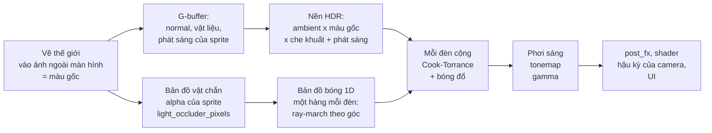

# Ánh sáng 2D (PBR) {#lighting}

njin có sẵn ánh sáng 2D **dựa trên vật lý (PBR)**: đèn điểm, đèn nón, đèn hướng, ánh sáng nền, bóng đổ mềm, normal map, vật liệu
(độ kim loại, độ nhám, che khuất), phát sáng và tonemap. Bật lên là cả thế giới, sprite lẫn tilemap, được chiếu sáng, không cần viết shader.

Cần biết trước: @ref sprites, @ref camera và @ref ecs. Chạy `njin_render_demo` rồi bấm phím `L` để xem mọi thứ dưới đây.
`njin_lighting_demo` tách từng trường hợp ra một phòng riêng (12 phòng: các loại đèn, `size` và bóng mềm, các hình vật chắn,
tường từ tilemap, bóng từ sprite, bề mặt PBR, màu và tonemap, nhiều đèn, platformer nhìn ngang), có ghi ngay trên màn hình
cần nhìn gì và dòng code tạo ra nó; mỗi phòng là một hàm trong `src/games/lighting_demo/rooms_*.cpp`.

@image html render_light_night.gif "Đêm trong rừng (njin_render_demo, phím L): đuốc của nhân vật chập chờn, bốn đèn cố định, thân mỗi cây đổ bóng từng pixel, hoa tự phát sáng. Quả cầu vàng là kim loại nên phản chiếu đèn khác gỗ và cỏ"

## Nó dựa trên những gì

| Phần | Theo |
|---|---|
| BRDF của mỗi đèn: khuếch tán Lambert + phản xạ gương Cook-Torrance (phân bố **GGX** với `alpha = roughness^2`, che khuất **Smith-Schlick** với `k = (r + 1)^2 / 8`, **Fresnel-Schlick**, `kD = (1 - F)(1 - metallic)`) | `pbr.fs` trong ví dụ `shaders_basic_pbr` của raylib: cùng công thức, nên art làm cho ví dụ đó dùng lại được |
| Bản đồ vật liệu xếp kênh **MRA**: R metallic, G roughness, B ambient occlusion | Cách xếp trong ví dụ đó |
| Bóng đổ **từng pixel** từ alpha của sprite: bản đồ vật chắn, bản đồ bóng 1D theo góc, làm mờ theo khoảng cách | Bài [2D Pixel-Perfect Shadows](https://github.com/mattdesl/lwjgl-basics/wiki/2D-Pixel-Perfect-Shadows) của mattdesl, thêm tính vùng nửa tối kiểu PCSS |
| Bóng đổ từ **đa giác** (hình bất kỳ, tường mỏng, ô tilemap), vùng nửa tối tính chính xác | Ý tưởng khối bóng (shadow volume) của ví dụ `shapes_top_down_lights` của raylib; vùng nửa tối theo bài [2D Lighting with Soft Shadows](https://www.slembcke.net/blog/SuperFastSoftShadows/) của Scott Lembcke: mỗi cạnh che một khoảng trên đường kính của nguồn sáng, tính bằng diện tích, không lấy mẫu |

Ánh sáng tính trong **không gian tuyến tính, HDR 16 bit**: ảnh sprite (sRGB) được đổi sang tuyến tính trước khi tính, cộng dồn các đèn, rồi phơi sáng, tonemap và gamma
để về màn hình. Khác `pbr.fs` của raylib ở ba chỗ, đều cho kết quả đúng hơn: albedo được đổi sang tuyến tính (ví dụ của raylib bỏ bước này), ánh sáng nền theo ambient
thật (nhân với albedo, che khuất và phản chiếu kim loại) thay vì cộng màu, và che khuất chỉ làm tối ánh sáng nền chứ không làm tối đèn trực tiếp.

## Bắt đầu: một đuốc

@include light_basic.cpp

Mỗi đèn là một **component `light_2d`** trên entity có `transform`. `lighting_set()` bật ánh sáng và đặt ánh sáng nền. Khi
chưa có đèn và ambient là trắng, ánh sáng không làm gì và không tốn gì.

## Ba loại đèn

| Loại | Dùng cho | Trường quan trọng |
|---|---|---|
| `light_point` | Đuốc, đèn đường, ngọn lửa: tỏa đều mọi hướng | `radius`, `size`, `intensity` |
| `light_spot` | Đèn pin, đèn sân khấu, mắt quái | thêm `angle` (hướng), `cone` (góc mở), `softness` (rìa nón) |
| `light_directional` | Mặt trời, mặt trăng: cùng một hướng ở mọi nơi | `angle` (hướng đi), `elevation` (cao thấp), `size` (độ mờ của bóng) |

@image html render_light_flash.gif "Đèn nón (phím N chọn scene): đèn pin của nhân vật quay theo con trỏ chuột. Rìa nón mềm dần, và vật trong nón đổ bóng"

@image html render_light_sun.png "Đèn hướng (phím N): mặt trời thấp từ phía trên trái. Mọi cây, bụi và đá trên bản đồ đổ bóng dài, kể cả vật ở ngoài màn hình một khoảng"

### Đèn tắt dần theo khoảng cách

`falloff` chọn đường cong độ sáng theo khoảng cách từ đèn:

| `falloff` | Độ sáng | Dùng khi |
|---|---|---|
| `falloff_physical` (mặc định) | `1 / (1 + (d / size)^2)`, nghịch đảo bình phương, cắt mượt về 0 ở `radius` | Muốn giống đèn thật: lõi sáng gắt, rìa tối nhanh |
| `falloff_linear` | Giảm đều từ tâm đến `radius` | Dễ đoán, dễ chỉnh |
| `falloff_smooth` | Phẳng ở tâm, tắt mượt ở `radius` | Quầng sáng kiểu cổ điển |
| `falloff_none` | Đều trong `radius`, tắt ở rìa | Vùng sáng cố định |

@image html render_light_falloff.png "Bốn đường cong với cùng một đèn (phím P đổi qua lại). Đèn theo vật lý (góc trên trái) tập trung sáng ở gần; ba kiểu còn lại rộng và đều hơn nên cần cường độ thấp hơn"

`size` là **kích thước nguồn sáng** (đơn vị thế giới). Với `falloff_physical` nó là khoảng cách mà độ sáng còn một nửa. Với mọi kiểu
nó còn là bán kính của nguồn khi đổ bóng: nguồn càng lớn, bóng càng mờ ở xa vật chắn (vùng nửa tối), giống đèn thật. `size = 0` cho bóng
sắc như dao.

### Màu, nhiệt độ màu, cường độ

- `color` là màu sRGB như mọi màu khác trong njin; engine tự tính trong không gian tuyến tính.
- `temperature` (kelvin) nhân thêm màu của một vật đen phát sáng ở nhiệt độ đó: nến 1900, đèn dây tóc 2700, ban ngày 6500, trời xanh
  10000. njin::light_color_kelvin() cho chính màu đó, dùng để tô ambient (bình minh 3500, trăng 9000).
- `intensity` là cường độ bức xạ, **có thể lớn hơn 1**: ánh sáng là HDR và phần dư được tonemap. Đèn theo vật lý giảm nhanh nên
  thường cần 4 đến 12; đèn hướng thường 1 đến 4.
- `height` là độ cao của đèn so với mặt phẳng cảnh: đèn càng thấp, bề mặt nghiêng (normal map) càng lộ rõ và phản xạ gương càng lệch. Đèn hướng dùng
  `elevation` (độ) thay cho `height`.

## Ánh sáng nền, độ phơi sáng, tonemap

njin::lighting_desc gồm:

| Trường | Nghĩa |
|---|---|
| `enabled` | Bật ánh sáng. Mặc định tắt |
| `ambient` | Ánh sáng có ở mọi nơi, nhân với màu gốc và độ che khuất của bề mặt (kim loại phản chiếu nó). Trắng là không tối đi, đen là tối hẳn |
| `exposure` | Hệ số nhân toàn bộ ánh sáng **trước tonemap**, như độ phơi sáng máy ảnh. Đổi dần để làm bình minh, hoặc vào hang |
| `tonemap` | Cách nén HDR về màn hình (bảng dưới) |
| `scale` | 1 là chi tiết đầy đủ. Nhỏ hơn thì cả ảnh đã chiếu sáng tính ở độ phân giải thấp rồi phóng lên: nhanh hơn nhiều, nhưng mờ |
| `shadow_reach` | **Độ dài bóng của đèn hướng**, đơn vị thế giới (xem dưới) |
| `shadow_columns`, `pixel_alpha`, `occluder_margin` | Bóng từng pixel, xem dưới |

| `tonemap` | Đặc điểm |
|---|---|
| `tonemap_shoulder` (mặc định) | Giữ nguyên các tông dưới 0.6, chỉ ép mượt phần sáng hơn về 1. Màu pixel art ở chỗ vừa sáng không bị đổi |
| `tonemap_reinhard` | `x / (1 + x)`: mềm, nhưng làm cả cảnh nhạt và tối đi |
| `tonemap_aces` | ACES filmic (xấp xỉ của Narkowicz): tương phản điện ảnh, bão hòa vừa. Nên đặt `exposure` cao hơn. Phím `T` trong demo đổi qua lại |

`lighting_set()` gọi mỗi frame được. Đặt `ambient` và `exposure` theo giờ trong ngày là cách làm chu kỳ ngày đêm.

### Độ dài bóng của mặt trời

Một vật cao H bị mặt trời ở góc `elevation` chiếu thì đổ bóng dài `H / tan(elevation)`, không phải mãi mãi. **`shadow_reach` đặt độ dài đó**: một vật chắn xa hơn thế phía sau
không đổ bóng lên điểm đang xét. Với cây cao 24 đơn vị và mặt trời 30 độ, khoảng 40 là hợp. Mặc định 600 là bóng gần như vô hạn: chỉ đúng khi vật chắn thưa; ở một khu rừng dày,
bất kỳ tia nào cũng gặp một thân cây ở đâu đó phía trên, nên cả bản đồ chìm trong bóng. Áp dụng cho cả bóng đa giác và bóng từng pixel. Độ mềm của bóng (`size` của đèn hướng) là một đĩa mặt trời có kích thước
góc cố định `size / 600`, không phụ thuộc `shadow_reach`.

## PBR: vật liệu của sprite

Mỗi pixel của cảnh có **màu gốc** (albedo: chính ảnh sprite) và, nếu sprite có, ba bản đồ phụ:

| Trường của `sprite` | Kênh | Nghĩa |
|---|---|---|
| `normal` | RGB | Normal map kiểu OpenGL (xanh lá hướng lên): bề mặt nghiêng về đâu, để đèn làm sprite nổi khối |
| `material` | R | **Metallic**: 0 phi kim (gỗ, đá, vải), 1 kim loại |
| | G | **Roughness**: 0 bóng gương, 1 nhám hoàn toàn |
| | B | **Ambient occlusion**: 1 là hở, nhỏ hơn là bị che (kẽ hở, chân cây), làm tối ánh sáng nền |
| `emissive`, `emissive_power` | RGB | **Phát sáng**: chỗ nào có màu là chỗ đó tự sáng, không cần đèn (hoa dạ quang, cửa sổ có đèn, mắt quái). Nhân với `emissive_power` từ 0 đến 8; lớn hơn 1 thì sáng hơn màu ảnh và tràn ra bloom |

Cả ba phải cùng kích thước và cách xếp frame với `texture`. Sprite không có bản đồ nào là bề mặt phẳng, phi kim, nhám 0.8, không bị che, không phát sáng, nên **mọi sprite cũ vẫn dùng được**.

@image html render_light_pbr.png "Trái: không có bản đồ PBR, các quả cầu vàng chỉ là ảnh phẳng. Phải: có normal, vật liệu (kim loại, nhám 0.36) và emissive (hoa): quả cầu nổi khối, có điểm sáng phản xạ, sáng rõ ở phía đối diện đèn; bông hoa tự sáng"

Mỗi đèn được tính bằng mô hình **Cook-Torrance**: khuếch tán (Lambert) cộng phản xạ gương, với năng lượng được bảo toàn: phần phản xạ lấy đi bao nhiêu thì phần khuếch tán bớt bấy nhiêu, và kim loại không có màu khuếch tán.
Kim loại còn phản chiếu ánh sáng nền (tô màu bởi chính nó), nên không đen hẳn trong bóng.

Cách làm bản đồ: `njin_render_demo/tools/make_assets.py` sinh normal map từ hình sprite (làm phồng viền alpha), bản đồ vật liệu (nhám, kim loại, che khuất theo chiều cao) và bản đồ phát sáng cho các sprite trong demo; đọc nó để lấy công thức.
Với art vẽ tay, Aseprite, Krita, hay công cụ như SpriteIlluminator xuất cùng dạng. Bản đồ MRA làm cho raylib dùng được ở đây, và ngược lại.

@warning Sprite xoay hoặc lật ngang không xoay hay lật normal theo. Với nhân vật quay sang trái/phải, dùng `flip_x` sẽ làm ánh sáng trên phần nổi khối đi sai hướng:
nếu nhân vật lật nhiều, làm sẵn frame quay trái riêng, hoặc chỉ dùng normal map nhẹ.

## Bóng đổ và vật chắn

Đèn đổ bóng lên mọi thứ nằm sau **vật chắn**. Có hai cách làm vật chắn, dùng chung hoặc riêng:

| | Vật chắn **từng pixel** (`light_occluder_pixels`) | Vật chắn **đa giác** (`light_occluder`, `light_occluder_sprite`, `light_occluders_from_tiles`) |
|---|---|---|
| Hình | Đúng từng pixel alpha của sprite (hoặc ảnh mặt nạ) | Đa giác: hình dựng sẵn, tự chỉ điểm, viền sprite, ô tilemap |
| Chi phí | Theo **cỡ vùng đèn**, không theo số vật chắn: hàng nghìn cây, cỏ, đá cũng như nhau | Theo số cạnh trong vùng đèn (các cạnh được chia ngăn theo góc) |
| Tường mỏng, đường mở | Không | Có (`light_occluder_line`) |
| Ô tilemap | Không trực tiếp | Có, nối cạnh thẳng hàng |
| Ngoài màn hình | Chỉ vật chắn trong ảnh màn hình mở rộng `occluder_margin` (mặc định 96 đơn vị thế giới) | Mọi vật chắn với tới đèn |
| Bóng mềm | Theo `size` của đèn, mềm dần từ chỗ vật chắn | Theo `size` của đèn, mềm dần từ chỗ vật chắn |
| Hợp với | Cây, bụi, đá, nhân vật, mọi thứ pixel art hữu cơ | Tường, hàng rào, vách, nhà; thứ có hình hình học rõ |

@image html render_light_shadows.png "Cùng cảnh đêm (phím O bật tắt bóng, phím B đổi cách): không bóng, bóng từ đa giác (thân cây là viên thuốc), và bóng từng pixel (thân cây lấy từ ảnh mặt nạ)"

Vật chắn **đi theo entity**: di chuyển, xoay, co giãn cùng nó; nhân vật động, hình sprite đổi theo frame animation, bóng theo ngay.

### Từng pixel

@include light_pixels.cpp

@image html render_light_pixels.png "Từng pixel (ví dụ trên): cây bên trái để cả ảnh chắn sáng nên bóng có cả tán lá; cây bên phải dùng ảnh mặt nạ chỉ có thân cây nên bóng chỉ là một vệt hẹp. Bóng mờ dần theo khoảng cách từ vật chắn"

Cách chạy, theo bài của mattdesl: các sprite có `light_occluder_pixels` được vẽ vào một ảnh (**bản đồ vật chắn**, lấy alpha); với mỗi đèn, một shader đi tia theo từng góc quanh đèn (cột của **bản đồ bóng 1D**), ghi các đoạn vật chắn
mà tia đi qua (chỗ bắt đầu và kết thúc). Khi tô sáng, mỗi pixel của cảnh tra cột ứng với góc của nó: sau chỗ kết thúc của một đoạn là trong bóng của nó. Đèn điểm chỉ cần đoạn đầu tiên (bóng của nó không có điểm cuối);
đèn hướng, vì bóng có độ dài, giữ tối đa 8 đoạn mỗi cột và lấy đoạn gần nhất phía sau điểm đang xét, nên một thân cây sau hòn đá vẫn đổ bóng riêng. Nhiều mẫu lân cận (16 mẫu, mỗi mẫu trong một phần bằng nhau của vùng nửa tối,
dịch bằng một độ lệch riêng cho từng pixel) rộng đúng bằng vùng nửa tối mà `size` của đèn tạo ra từ độ sâu trung bình của vật chắn (tìm vật chắn rồi lọc, kiểu PCSS): mọi phần đều được lấy mẫu nên vật chắn mảnh không lọt giữa các mẫu và
để lại các tia nan quạt; phần sai số còn lại là hạt mịn. Đèn hướng dùng các dải song song thay cho các góc.

- **`mask`** chọn ảnh làm vật chắn (cùng kích thước và cách xếp frame với ảnh sprite). Để trống là dùng chính ảnh sprite. Dùng để chỉ thân cây chắn sáng chứ không phải cả tán lá.
- **`lighting_desc::pixel_alpha`** là ngưỡng alpha coi là đặc (mặc định 0.5); **`shadow_columns`** là số cột của bản đồ bóng, 0 (mặc định) là tự chọn sao cho tia cách nhau khoảng một pixel ở rìa đèn rộng nhất;
  ít cột hơn thì vật chắn mảnh lọt giữa hai tia và bóng xa đèn vỡ thành các tia nan quạt; **`occluder_margin`** là bề rộng dải ngoài màn hình được đọc (mặc định 96).
- Vật chắn **không tự che chính nó**: điểm nằm trong khối đầu tiên trên tia, tức chính vật đó, vẫn sáng; và đèn nằm trong một vật chắn (đuốc trên người) không bị nó chặn.
- Lỗi cần biết: chỉ vật chắn trong ảnh màn hình mở rộng mới đổ bóng; bóng cỡ pixel của ảnh (không mượt hơn ảnh); vật chắn nhỏ hơn một texel của bản đồ (nếu `scale` nhỏ) có thể mất.

@image html render_light_sun_methods.png "Mặt trời thấp, hai cách làm bóng: trái là đa giác (thân cây là viên thuốc hẹp), phải là từng pixel (thân cây lấy từ ảnh mặt nạ, bụi và đá theo đúng hình của chúng)"

### Đa giác

Vật chắn là component `light_occluder` trên entity có transform, hình dạng do bạn chọn.

@image html render_light_shapes.png "Các hình vật chắn đa giác (đường viền xám, ví dụ dưới): hình chữ nhật, hình tròn, elip, viên thuốc, đa giác lõm tự chỉ điểm, tường mỏng gấp khúc, và hình sprite của cái cây. Mỗi hình đổ bóng đúng dáng của nó"

@include light_shapes.cpp

| Cách | Dùng cho |
|---|---|
| `light_occluder_box()` | Thùng, tường ngắn, gốc cây vuông (đặt neo `{0.5, 1}` để đứng trên mặt đất) |
| `light_occluder_circle()`, `light_occluder_ellipse()` | Bụi cây, cột tròn, đá |
| `light_occluder_capsule()` | Nhân vật đứng, thân cây, cột: dài mà tròn hai đầu |
| `light_occluder_line()` | **Đường mở**, mỏng, chắn cả hai phía: tường, hàng rào, mép vách |
| `light_occluder{points}` | Đa giác đóng bất kỳ, kể cả lõm; viết theo chiều nào cũng được |
| `light_occluder_sprite` | **Theo hình sprite**: viền của các pixel đủ đục trong frame đang hiện, đổi theo animation, lật, xoay, co giãn |
| `light_occluders_from_tiles()` | **Theo tilemap**: viền các ô tường, nối cạnh thẳng hàng |

#### Theo hình sprite

Gắn `light_occluder_sprite{.alpha, .simplify}` vào entity có `sprite` là xong: engine tự trích viền của frame đang hiện (theo `sprite.source` nên
đúng với từng frame animation), nhớ lại cho mỗi frame, và đặt theo `flip_x`, `flip_y`, `origin`, `transform`. `alpha` là ngưỡng đục; `simplify` (pixel ảnh) làm trơn
viền bậc thang thành vài cạnh, rẻ hơn nhiều: 1 đến 2 là hợp với pixel art. Ảnh đọc từ card đồ họa một lần cho mỗi texture, nên ảnh vẽ vào render texture không dùng được (ảnh trong atlas thì được).

#### Theo tilemap

@include light_tiles.cpp

njin::light_occluders_from_tiles() trả về các vòng viền (một vòng cho mỗi khối liền, và một cho mỗi lỗ trong khối, đánh dấu `hole`) tính từ gốc tilemap.
Gọi lại khi tường đổi. Hàm chỉ tính hình học, không cần cửa sổ.

#### Quy tắc

- **Vật chắn đặc không tự che chính nó.** Điểm nằm trong hình không bị chính hình đó đổ bóng, và đèn nằm trong hình (đuốc trên người nhân vật)
  không bị hình đó chặn. Vì vậy hình có thể vừa khít với hình vẽ. Một vật lõm (chữ L) vẫn che phần này của nó bằng phần kia.
- Đường mở (`closed = false`) là tường mỏng: chắn từ cả hai phía.
- Đa giác đóng có thể là **lỗ**: `hole = true` nghĩa là bên trong là khoảng trống. Dùng cho vòng trong của phòng có tường dày.
- Mỗi ngăn góc của một đèn giữ tối đa 64 cạnh (nếu nhiều hơn, giữ những cạnh gần đèn nhất). Đèn hướng (mặt trời) chia màn hình thành các dải chạy dọc theo tia; khi dải quá đầy (nhìn xa một thành phố), engine tự chia màn hình thêm thành tối đa 16 băng dọc theo tia, mỗi băng chỉ giữ cạnh nằm trong nó hoặc cách nó chưa tới `shadow_reach` về phía mặt trời, rồi vẽ từng băng. Ô nào vẫn quá 64 cạnh thì giữ những cạnh dài nhất, nên bóng của vật nhỏ (cây, xe) mất trước, bóng nhà vẫn còn. `reach` của `light_occluder` cho engine loại nhanh vật chắn xa; các hàm dựng sẵn tự đặt.

## Ánh sáng chạy thế nào

Ánh sáng chạy **trước** các hiệu ứng dựng sẵn (post_fx, @ref post_processing), nên bloom làm đèn tỏa sáng, và shader hậu kỳ của bạn thấy cảnh đã được chiếu sáng.
UI vẽ ở `phase_post_render` không bị ảnh hưởng.

Vài điều mô hình 2D này giả định, cần biết: người nhìn ở thẳng phía trên (camera trực giao), bề mặt hướng về người nhìn, và đèn ở độ cao `height` phía trên mặt phẳng cảnh.
Các sprite không có độ sâu riêng, nên không có che khuất giữa các sprite ngoài bóng đổ từ vật chắn.

## Hiệu năng

Ánh sáng đã dùng các tối ưu thường gặp:

| Tối ưu | Tác dụng |
|---|---|
| Loại đèn và vật chắn ngoài tầm nhìn, và vật chắn ngoài vùng với tới của mọi đèn | Không tốn gì cho thứ không ảnh hưởng đến khung hình |
| Mỗi đèn là **một quad** vừa đúng vùng nó với tới (đèn nón chỉ hộp bao quanh nón) | Tiết kiệm fill rate |
| Pixel đèn không tới được, hoặc tới quá yếu để thấy, bị bỏ trước khi tính bóng | Không tính bóng cho phần rìa tối |
| **Bản đồ bóng 1D**: một hàng mỗi đèn, ray-march một lần cho mỗi góc rồi mỗi pixel chỉ tra một cột | Chi phí bóng từng pixel theo cỡ vùng đèn, không theo số vật chắn |
| Đa giác: lưới không gian, **chia các cạnh vào 32 ngăn** (cung góc quanh đèn, hoặc dải vuông góc với tia của đèn hướng) đưa lên texture | Mỗi pixel chỉ thử với vài cạnh của ngăn nó, không phải mọi cạnh gần đèn; rừng dày không còn mất bóng ở xa |
| Bỏ các cạnh quay mặt về phía cả nguồn sáng (không bao giờ chặn tia) | Nửa số cạnh |
| Vùng nửa tối tính bằng diện tích: mỗi cạnh chiếu lên đường kính của nguồn sáng một lần, các khoảng bị che được gộp (không cộng) trên 64 lát bằng diện tích | Mỗi pixel duyệt các cạnh của ngăn một lần; bóng mềm mượt, không dải, không hạt |
| Vị trí uniform tra một lần; bộ đệm dùng lại giữa các frame; sin/cos xoay tính một lần cho mỗi vật chắn | Ít việc cho CPU |
| Ảnh ánh sáng HDR 16 bit float; không chạy khi không có đèn và ambient là trắng | Không tốn khi không cần |
| `lighting_desc::scale` | Giảm độ phân giải toàn bộ lượt ánh sáng |

Số đo trên máy dev (RTX 3050 Laptop, 1280 x 720, 3000 sprite trên bản đồ, 6 đèn có bóng, normal, vật liệu và phát sáng bật):

| | Thời gian một frame |
|---|---|
| Không ánh sáng | khoảng 1.9 ms |
| 6 đèn, không bóng | khoảng 5.0 ms |
| 6 đèn, bóng đa giác (2250 vật chắn) | khoảng 6.7 ms |
| 6 đèn, bóng từng pixel (mọi cây, bụi, đá) | khoảng 5.9 ms |
| Một đèn hướng phủ cả màn hình, bóng đa giác | khoảng 5.4 ms |
| Một đèn hướng phủ cả màn hình, bóng từng pixel | khoảng 5.7 ms |

Con số của máy bạn sẽ khác; đo bằng `run_inspected.bat render_demo` và njin_inspector. Nếu cần nhanh hơn, theo thứ tự hiệu quả: giảm số đèn có bóng
(`cast_shadows = false` cho đèn nhỏ), giảm `radius`, `scale = 0.5`, tắt vật liệu và normal (không tốn G-buffer), giảm `shadow_columns`, bớt số cạnh của vật chắn đa giác.

## Giới hạn

- Tối đa 64 đèn mỗi frame (nếu nhiều hơn, giữ những đèn gần giữa màn hình nhất); bóng từng pixel cho tối đa 64 đèn có bóng.
- Không có phản chiếu môi trường: kim loại chỉ phản chiếu đèn và ambient.
- Ảnh hưởng của `flip_x`, xoay lên normal: xem cảnh báo ở trên.
- Cần OpenGL 3.3. Texture float không có thì ánh sáng cảnh báo một lần và chạy ở 8 bit (sáng tối đa 1).
- Ánh sáng chỉ tính lại từ đầu mỗi frame: chưa có bộ nhớ đệm cho đèn tĩnh.

## Điều khiển trong demo

| Phím | Việc |
|---|---|
| `L` | Bật tắt ánh sáng |
| `N` | Đổi scene: đuốc ban đêm, mặt trời thấp, đèn pin |
| `O` | Bóng đổ bật tắt |
| `B` | Bóng từng pixel hoặc bóng đa giác |
| `M` | Normal, vật liệu và phát sáng bật tắt |
| `P` | Đổi đường cong tắt dần: theo vật lý, tuyến tính, mượt, không |
| `T` | Đổi tonemap: shoulder, Reinhard, ACES |
