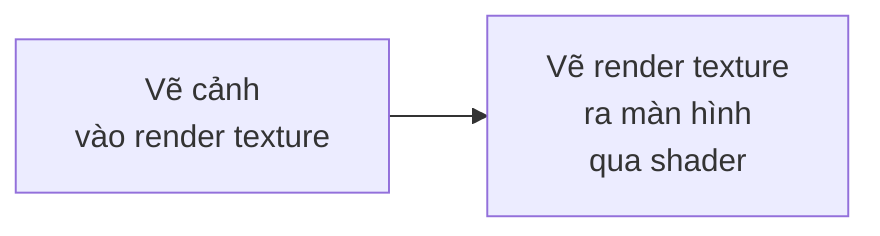
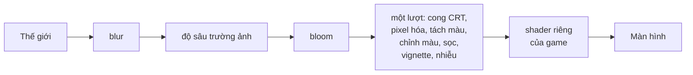

# Hậu kỳ (post-processing) {#post_processing}

Hậu kỳ là áp shader lên **cả khung hình** sau khi đã vẽ xong: làm mờ, CRT,
viền tối (vignette), đổi màu...

Các hiệu ứng hay dùng đã có sẵn, không cần viết shader: xem
[Hiệu ứng dựng sẵn](#post_builtin) ở cuối trang. Phần đầu trang dành cho khi bạn muốn
tự viết shader.

Nguyên tắc:



Render texture là một ảnh ngoài màn hình. Bạn vẽ cảnh vào nó, rồi vẽ nó ra màn
hình với một shader bật lên. Shader chạy trên từng pixel của cả cảnh.

Các shader dựng sẵn được biên dịch **lúc game khởi động**, không phải lúc bật hiệu ứng lần đầu,
nên mở menu tạm dừng với `blur` không làm khựng frame. `blur` từ 3 pixel trở lên chạy ở nửa
độ phân giải (chỉ chạm một phần tư số pixel) rồi phóng lại; nhỏ hơn thì chạy ở độ phân giải đầy đủ.

## Ví dụ

@include post_processing.cpp

Hai bước ở hai phase khác nhau:

| Bước | Phase | Vì sao |
|---|---|---|
| Vẽ cảnh vào render texture | `phase_post_update` | njin::render_texture_begin() đặt lại phép biến đổi của camera nên không được gọi trong lúc camera đang bật |
| Vẽ render texture ra màn hình | `phase_post_render` | Đây là không gian màn hình, không có camera, nên ảnh phủ đúng cả cửa sổ |

## Các hàm

| Hàm | Việc làm |
|---|---|
| njin::render_texture_load() | Tạo render texture với kích thước cho trước |
| njin::render_texture_begin() | Bắt đầu vẽ vào nó. Có bản nhận thêm màu để xóa trước |
| njin::render_texture_end() | Kết thúc vẽ vào nó |
| njin::render_texture_draw() | Vẽ nội dung của nó ra, theo đúng chiều |
| njin::render_texture_size() | Kích thước (pixel) |
| njin::render_texture_unload() | Giải phóng |

Kích thước thường bằng njin::screen_size(). Nếu đổi kích thước cửa sổ, hãy tạo
lại render texture.

## Hậu kỳ cho cả thế giới qua camera

Cách trên áp hậu kỳ lên những thứ **bạn tự vẽ vào render texture**. Muốn áp lên **toàn bộ
thế giới** mà camera đang vẽ (sprite, tilemap, mọi thứ trong `phase_render`), chỉ cần một
dòng:

```cpp
njin::camera_set_post_shader(ctx, effect);         // bật
njin::camera_set_post_shader(ctx, njin::shader_handle{}); // tắt
```

Engine vẽ thế giới vào một ảnh ngoài màn hình có kích thước bằng cửa sổ (tự tạo lại khi
cửa sổ đổi kích thước), rồi vẽ ảnh đó ra màn hình qua shader. UI trong `phase_post_render`
vẽ sau đó nên không bị ảnh hưởng. Đặt uniform như bình thường bằng các hàm
`shader_set_*()`.

Shader hậu kỳ đọc được thêm ảnh phụ (bảng màu, nhiễu) và mảng uniform (danh sách đèn): xem @ref shader_advanced,
có ví dụ đêm với đèn, hoàng hôn bằng bảng màu và sương mù bằng nhiễu.

## Hiệu ứng dựng sẵn {#post_builtin}

njin::post_fx_set() bật các hiệu ứng có sẵn lên toàn bộ thế giới, không cần viết shader.
Giống shader ở trên, chúng không đụng đến UI trong `phase_post_render`.

@include post_builtin.cpp

| Hiệu ứng | Trường | Tắt khi |
|---|---|---|
| Chỉnh màu | `brightness`, `contrast`, `saturation`, `sepia`, `tint` | 0, 1, 1, 0, trắng |
| Vignette (tối viền) | `vignette`, `vignette_radius`, `vignette_softness`, `vignette_color` | `vignette` = 0 |
| Bloom (quầng sáng) | `bloom`, `bloom_threshold`, `bloom_radius` | `bloom` = 0 |
| Làm mờ | `blur` (pixel) | 0 |
| Độ sâu trường ảnh (3D) | `dof` (pixel), `dof_focus`, `dof_range`, `dof_falloff` | `dof` = 0 |
| Tách màu | `chromatic` (pixel) | 0 |
| Sọc CRT | `scanlines`, `scanline_size` | `scanlines` = 0 |
| Cong CRT | `crt_curve` | 0 |
| Pixel hóa | `pixelate` (cỡ ô, pixel) | dưới 2 |
| Nhiễu hạt | `grain` | 0 |

Ảnh dưới đây chụp từ `njin_render_demo`: không hậu kỳ, rồi bật CRT (phím 6), bloom (phím 5) và blur (phím 4). Bloom chỉ lộ ra ở chỗ có vùng sáng, nên ảnh của nó ghép hai bản (tắt và bật) của một cảnh có hạt sáng.

@image html render_demo.png "Không hậu kỳ"

@image html render_demo_crt.png "CRT (phím 6): sọc ngang và màn hình cong ở các cạnh"

@image html render_demo_bloom.png "Bloom (phím 5), cùng một cảnh: trái là tắt, phải là bật. Vùng sáng tỏa ra xung quanh, thấy rõ nhất ở cụm hạt vàng góc dưới phải, và quầng xanh quanh đài phun rộng hơn"

@image html render_demo_blur.png "Blur: làm mờ cả cảnh"

Bộ có sẵn trong `namespace njin::post`: njin::post::crt(), njin::post::noir(),
njin::post::vintage(), njin::post::dream(), njin::post::glow(), njin::post::retro(),
njin::post::hurt(), njin::post::paused().

### Độ sâu trường ảnh {#post_dof}

`dof` làm mờ những gì gần hơn hay xa hơn một khoảng cách, như ống kính máy ảnh lấy nét:
nét trong khoảng `dof_focus` ± `dof_range`, rồi mờ dần trên quãng `dof_falloff` tới mức
`dof` pixel. Engine đọc độ sâu mà lần vẽ 3D (begin_3d() ... end_3d()) của frame để lại, nên
hiệu ứng chỉ áp cho cảnh 3D; frame không vẽ 3D thì bỏ qua. Khoảng cách đo theo hướng nhìn
của camera, bằng đơn vị 3D.

Lấy nét vào một vật: khoảng cách là hình chiếu của vector từ camera tới vật lên hướng nhìn.

@code
const njin::vec3 look = njin::normalize(cam.target - cam.position);
njin::post_fx fx{};
fx.dof = 7.0f;                                     // mờ nhất 7 pixel
fx.dof_focus = njin::dot(hero_pos - cam.position, look);
fx.dof_range = 2.0f;                               // nét trong ±2 đơn vị quanh vật
fx.dof_falloff = 6.0f;                             // mờ dần trên 6 đơn vị tiếp theo
njin::post_fx_set(ctx, fx);
@endcode

Cảnh được làm mờ một lần ở nửa kích thước rồi trộn với ảnh nét theo độ sâu từng pixel:
bốn lượt vẽ toàn màn hình, như `blur` rộng. UI vẽ trong `phase_post_render` không bị mờ.

Thứ tự áp:



Bloom, blur và độ sâu trường ảnh tốn thêm vài lượt vẽ toàn màn hình; các hiệu ứng còn lại gộp trong một lượt
nên gần như miễn phí. Mọi trường sửa được mỗi frame: njin::post_fx_lerp() giúp chuyển mượt
giữa hai bộ.
