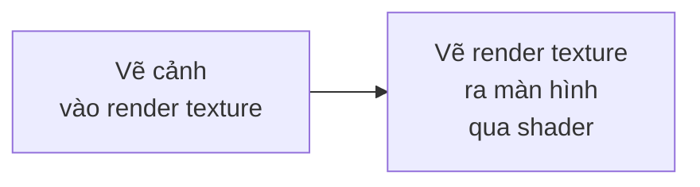

# Hậu kỳ (post-processing) {#post_processing}

Hậu kỳ là áp shader lên **cả khung hình** sau khi đã vẽ xong: làm mờ, CRT,
viền tối (vignette), đổi màu...

Nguyên tắc:

Render texture là một ảnh ngoài màn hình. Bạn vẽ cảnh vào nó, rồi vẽ nó ra màn
hình với một shader bật lên. Shader chạy trên từng pixel của cả cảnh.

## Ví dụ

@include post_processing.cpp

Hai bước ở hai phase khác nhau:

| Bước | Phase | Vì sao |
|---|---|---|
| Vẽ cảnh vào render texture | `phase_post_update` | njin::render_texture_begin() đặt lại phép biến đổi của camera nên không được gọi trong lúc camera đang bật |
| Vẽ render texture ra màn hình | `phase_post_render` | Đây là không gian màn hình, không có camera, nên ảnh phủ đúng cả cửa sổ |

## Các hàm

| Hàm | Việc làm |
|---|---|
| njin::render_texture_load() | Tạo render texture với kích thước cho trước |
| njin::render_texture_begin() | Bắt đầu vẽ vào nó. Có bản nhận thêm màu để xóa trước |
| njin::render_texture_end() | Kết thúc vẽ vào nó |
| njin::render_texture_draw() | Vẽ nội dung của nó ra, theo đúng chiều |
| njin::render_texture_size() | Kích thước (pixel) |
| njin::render_texture_unload() | Giải phóng |

Kích thước thường bằng njin::screen_size(). Nếu đổi kích thước cửa sổ, hãy tạo
lại render texture.

## Hạn chế hiện tại

Cách trên áp hậu kỳ lên những thứ **bạn tự vẽ vào render texture**. Nó **chưa** áp
được lên phần thế giới đang được module camera vẽ qua camera, vì:

- Module camera bật camera ở `phase_pre_render` và module của game chạy **sau** nó.
- Nếu game gọi njin::render_texture_begin() sau đó, phép biến đổi camera bị đặt lại.

Muốn hậu kỳ cả thế giới có camera, cần engine hỗ trợ trực tiếp: module camera vẽ
cảnh vào một render texture rồi mới ra màn hình qua shader. Đây là việc chưa làm.
