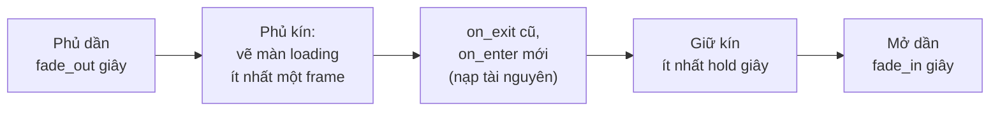

# Scene {#scenes}

Scene là một trạng thái lớn của game: menu, đang chơi, tạm dừng, game over. Mỗi lúc chỉ
có một scene chạy.

@include scenes.cpp

## Ba việc scene làm cho bạn

**1. System chỉ chạy trong một scene.** Đặt `scene` trong njin::sys_desc. System không
đặt scene (handle id 0) chạy ở mọi scene.

**2. Gọi hàm khi vào và rời scene.** `on_enter` và `on_exit` trong njin::scene_desc, mỗi
hàm chạy đúng một lần mỗi lần chuyển. Đây là chỗ tạo thế giới của màn chơi và lưu điểm.

**3. Tự hủy entity của scene.** Gắn njin::scene_owned vào entity; khi rời scene đó, engine
hủy nó. Không phải tự dọn.

## Chuyển scene

njin::scene_set() **không chuyển ngay** mà ở **đầu frame sau**, trước mọi system của
frame đó. Frame hiện tại vì thế chạy trọn vẹn trong một scene.

Khi chuyển, engine lần lượt:

1. gọi `on_exit` của scene cũ,
2. hủy mọi entity có njin::scene_owned trỏ tới scene cũ,
3. gọi `on_enter` của scene mới.

Scene đầu tiên cũng được đặt bằng njin::scene_set(), thường trong `phase_startup`. Trước
đó chưa có scene nào: chỉ system không gắn scene chạy.

| Hàm | Việc làm |
|---|---|
| njin::scene_register() | Tạo scene. Tên đã có thì trả về scene cũ |
| njin::scene_find() | Tìm scene theo tên |
| njin::scene_set() | Chuyển scene ở đầu frame sau |
| njin::scene_current() | Scene đang chạy |

## Chuyển cảnh mờ dần

njin::scene_fade() đổi scene sau một hiệu ứng mờ dần, và có thể hiện màn hình loading:

@include scene_fade.cpp

- Màn hình loading (`draw_loading`) được vẽ **trước** khi `on_enter` của scene mới chạy, nên
  `on_enter` nạp tài nguyên nặng thì người chơi vẫn thấy nó, không thấy cửa sổ đứng hình.
- Thời gian tính theo giờ thật: pause và time_set_scale() không ảnh hưởng.
- Game vẫn chạy trong lúc chuyển. Dùng njin::scene_transitioning() để bỏ qua nhập liệu nếu cần.
- Gọi lại njin::scene_fade() khi đang chuyển thì chỉ đổi scene đích. njin::scene_set() khi đang
  chuyển thì hủy hiệu ứng và đổi ngay frame sau.
- Lớp phủ nằm trên mọi thứ, kể cả UI.

| Hàm | Việc làm |
|---|---|
| njin::scene_fade() | Chuyển scene với hiệu ứng mờ dần |
| njin::scene_transitioning() | Đang chuyển không |
| njin::scene_transition_cover() | Độ phủ hiện tại, 0..1 |

## Scene hay tạm dừng?

Menu tạm dừng thường **không** nên là một scene riêng: chuyển scene sẽ hủy thế giới đang
chơi. Hãy giữ scene "play" và dùng njin::time_set_paused() (xem @ref time), rồi vẽ menu
khi đang dừng. Game Pong trong `src/games/pong` làm theo cách này.
