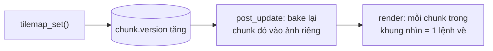

# Tilemap {#tilemap}

Tilemap là lưới ô vuông vẽ từ một **tileset** (một ảnh gồm các ô cùng kích thước). Dùng
cho bản đồ platformer, RPG, thế giới đào xới.

@include tilemap.cpp

## Tạo tilemap

Gắn njin::transform và njin::tilemap vào một entity. `transform.pos` là góc trên trái
của ô (0, 0) trong thế giới.

- `tileset`, `tile_size`: ảnh và kích thước một ô.
- Mỗi ô giữ **số thứ tự ô trong tileset** (từ 0, theo hàng), hoặc **-1** là ô trống.
- Đổi ô bằng njin::tilemap_set(), đọc bằng njin::tilemap_get().
- `layer`, `tint`, `visible` như sprite.

Tilemap **không có kích thước cố định** và tọa độ ô có thể âm: đặt ô ở đâu thì bản đồ
mở rộng tới đó.

## Viết bản đồ bằng chữ

Không muốn dùng Tiled hay LDtk? Viết bản đồ như ngày xưa: mỗi ký tự là một ô.
njin::tilemap_from_text() đọc một chuỗi nhiều dòng (viết thẳng trong code, hoặc đọc từ một file văn bản bằng
njin::file_read()), còn njin::tilemap_from_rows() nhận từng hàng riêng cho bản đồ nhỏ.

@include tilemap_text.cpp

Tham số thứ ba là **bảng ký tự** (njin::tile_key): ký tự nào đặt ô số mấy. Ở ví dụ trên `#` là ô 7 (tường đá) và `.` là ô 0
(cỏ). Ký tự không có trong bảng thì có hai trường hợp:

- ` `, `.` và tab là **ô trống**;
- mọi ký tự khác là **điểm đánh dấu**: hàm không đặt ô nào, mà trả về vị trí của nó trong một danh sách
  njin::tile_marker (theo thứ tự đọc, từ trên xuống và trái sang phải). Đây là chỗ để đặt điểm xuất hiện
  của người chơi (`P`), kẻ địch (`E`), đồng xu, cửa... Tự tạo entity ở đúng ô đó; njin::tilemap_cell_rect() đổi ô
  thành vị trí trong thế giới.

Một ký tự có thể vừa đặt ô vừa được báo lại: `{'P', 0, true}` đặt ô cỏ 0 dưới chân nhân vật **và** báo vị trí của `P`,
để không có lỗ hổng dưới người chơi.

| Quy tắc | Chi tiết |
|---|---|
| Vị trí | Dòng đầu là hàng 0, ký tự đầu là cột 0, cộng thêm tham số `origin` nếu có. Các hàng dài ngắn khác nhau được |
| Dòng đầu chuỗi | Nếu chuỗi bắt đầu bằng xuống dòng thì xuống dòng đó bị bỏ, để viết `R"(` rồi xuống dòng mới đến hàng đầu. Dòng cuối kết thúc bằng xuống dòng không thêm hàng rỗng |
| Kết thúc dòng Windows | `\r\n` được hiểu đúng, không có ký tự `\r` lạc |
| Chồng lớp | Ô trống và điểm đánh dấu **không đụng** tới ô đang có, nên gọi nhiều lần cho nhiều lớp (nền, rồi vật trang trí). Muốn xóa một ô, ghi rõ trong bảng: `{'x', -1}` |
| Hình va chạm | Ký tự trong bảng gọi njin::tilemap_set(), nên njin::tilemap_set_shape() và njin::tilemap_animate() áp dụng như bình thường |

@note Bản đồ chữ chỉ dựng **ô** và báo vị trí. Nó không tạo entity, không có thuộc tính hay đối tượng
như Tiled/LDtk (xem @ref level). Muốn có những thứ đó thì đọc danh sách njin::tile_marker rồi tạo entity, hoặc
dùng njin::prefab_spawn() (@ref prefabs) cho từng ký tự. Muốn lưu bản đồ ra file thì ghi lại chính chuỗi chữ.

## Chunking

Ô được lưu và vẽ theo **chunk**: khối 32 x 32 ô (njin::tile_chunk_size).

**Lưu trữ thưa.** Chỉ những chunk có ít nhất một ô mới tồn tại. Một bản đồ rộng hàng
nghìn ô nhưng thưa vẫn nhẹ. Xóa hết ô của một chunk thì chunk bị xóa.

**Vẽ sẵn (bake).** Mỗi chunk được vẽ một lần vào một ảnh riêng. Mỗi frame, chunk chỉ tốn
**một lệnh vẽ** thay vì 1024 lệnh cho từng ô. Chunk chỉ được vẽ lại khi có ô đổi: mỗi
chunk có số `version` tăng lên mỗi lần njin::tilemap_set() đổi nó.

**Chỉ vẽ những gì nhìn thấy.** Chỉ chunk nằm trong khung nhìn của camera
(njin::camera_bounds()) mới được bake và vẽ.

**Giải phóng.** Ảnh của chunk khuất khỏi màn hình khoảng 5 giây (300 frame) bị giải
phóng, và được bake lại khi quay lại. Ảnh của chunk hay tilemap đã bị xóa được giải
phóng ngay frame sau.

**Đổi ô sau khi đã bake.** Chunk vừa đổi trong frame này (ví dụ trong `phase_render`) sẽ
được vẽ từng ô một lần cho đúng, rồi được bake lại ở frame sau. Không bao giờ hiện ảnh cũ.

@warning Luôn đổi ô bằng njin::tilemap_set(). Sửa thẳng `tilemap::chunks` thì engine không
biết chunk nào cần vẽ lại.

## Va chạm với tilemap

Mọi ô không trống đều là vật cản.

| Hàm | Việc làm |
|---|---|
| njin::tilemap_cell_at() | Ô chứa một điểm trong thế giới |
| njin::tilemap_cell_rect() | Hình chữ nhật của một ô trong thế giới |
| njin::tilemap_overlaps() | Một hình chữ nhật có chạm ô nào không |
| njin::tilemap_move() | Di chuyển một hình chữ nhật, dừng khi đụng ô |

njin::tilemap_move() đi theo **trục ngang trước rồi đến trục dọc**, nên nhân vật trượt dọc
tường thay vì dính vào. `hit_y && delta.y > 0` nghĩa là đang đứng trên mặt đất.

Cần va chạm với cả tilemap lẫn các entity khác (thùng, cửa, quái) thì gắn collider
`collider_tiles` lên tilemap và dùng njin::collision_move(), xem @ref collision.

@note Mỗi lần gọi, mỗi trục nên dời không quá một ô. Vật đi quá nhanh có thể xuyên qua
tường mỏng. Đặt vật lý trong `phase_fixed_update` để bước đi nhỏ và đều (xem @ref time).

## Hình va chạm và animation của ô

Mỗi loại ô có thể có **hình va chạm** riêng (bục một chiều, dốc, không va chạm) và **animation** (nước,
đuốc). Cả hai đặt theo số thứ tự ô, nên áp dụng cho mọi ô cùng loại:

@code
njin::tilemap_set_shape(map, 3, njin::tile_one_way);
njin::tilemap_set_shape(map, 4, njin::tile_slope_r);
njin::tilemap_animate(map, 10, {10, 11, 12, 13}, 0.18f); // ô 10 chạy qua bốn frame
@endcode

Bản đồ nạp từ Tiled và LDtk có sẵn cả hai (xem @ref level). Ô có animation không bị bake vào ảnh
chunk mà vẽ chồng lên mỗi frame, nên chunk tĩnh vẫn rẻ. `collision_move()` và `collision_raycast()`
hiểu hình của ô; tilemap_move() thì coi mọi ô là vật cản. Xem @ref platformer để dùng chúng.
