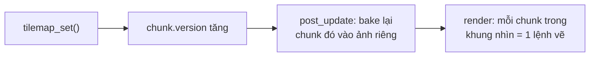

# Tilemap {#tilemap}

Tilemap là lưới ô vuông vẽ từ một **tileset** (một ảnh gồm các ô cùng kích thước). Dùng
cho bản đồ platformer, RPG, thế giới đào xới.

@include tilemap.cpp

## Tạo tilemap

Gắn njin::transform và njin::tilemap vào một entity. `transform.pos` là góc trên trái
của ô (0, 0) trong thế giới.

- `tileset`, `tile_size`: ảnh và kích thước một ô.
- Mỗi ô giữ **số thứ tự ô trong tileset** (từ 0, theo hàng), hoặc **-1** là ô trống.
- Đổi ô bằng njin::tilemap_set(), đọc bằng njin::tilemap_get().
- `layer`, `tint`, `visible` như sprite.

Tilemap **không có kích thước cố định** và tọa độ ô có thể âm: đặt ô ở đâu thì bản đồ
mở rộng tới đó.

## Chunking

Ô được lưu và vẽ theo **chunk**: khối 32 x 32 ô (njin::tile_chunk_size).

**Lưu trữ thưa.** Chỉ những chunk có ít nhất một ô mới tồn tại. Một bản đồ rộng hàng
nghìn ô nhưng thưa vẫn nhẹ. Xóa hết ô của một chunk thì chunk bị xóa.

**Vẽ sẵn (bake).** Mỗi chunk được vẽ một lần vào một ảnh riêng. Mỗi frame, chunk chỉ tốn
**một lệnh vẽ** thay vì 1024 lệnh cho từng ô. Chunk chỉ được vẽ lại khi có ô đổi: mỗi
chunk có số `version` tăng lên mỗi lần njin::tilemap_set() đổi nó.

**Chỉ vẽ những gì nhìn thấy.** Chỉ chunk nằm trong khung nhìn của camera
(njin::camera_bounds()) mới được bake và vẽ.

**Giải phóng.** Ảnh của chunk khuất khỏi màn hình khoảng 5 giây (300 frame) bị giải
phóng, và được bake lại khi quay lại. Ảnh của chunk hay tilemap đã bị xóa được giải
phóng ngay frame sau.

**Đổi ô sau khi đã bake.** Chunk vừa đổi trong frame này (ví dụ trong `phase_render`) sẽ
được vẽ từng ô một lần cho đúng, rồi được bake lại ở frame sau. Không bao giờ hiện ảnh cũ.

@warning Luôn đổi ô bằng njin::tilemap_set(). Sửa thẳng `tilemap::chunks` thì engine không
biết chunk nào cần vẽ lại.

## Va chạm với tilemap

Mọi ô không trống đều là vật cản.

| Hàm | Việc làm |
|---|---|
| njin::tilemap_cell_at() | Ô chứa một điểm trong thế giới |
| njin::tilemap_cell_rect() | Hình chữ nhật của một ô trong thế giới |
| njin::tilemap_overlaps() | Một hình chữ nhật có chạm ô nào không |
| njin::tilemap_move() | Di chuyển một hình chữ nhật, dừng khi đụng ô |

njin::tilemap_move() đi theo **trục ngang trước rồi đến trục dọc**, nên nhân vật trượt dọc
tường thay vì dính vào. `hit_y && delta.y > 0` nghĩa là đang đứng trên mặt đất.

@note Mỗi lần gọi, mỗi trục nên dời không quá một ô. Vật đi quá nhanh có thể xuyên qua
tường mỏng. Đặt vật lý trong `phase_fixed_update` để bước đi nhỏ và đều (xem @ref time).
