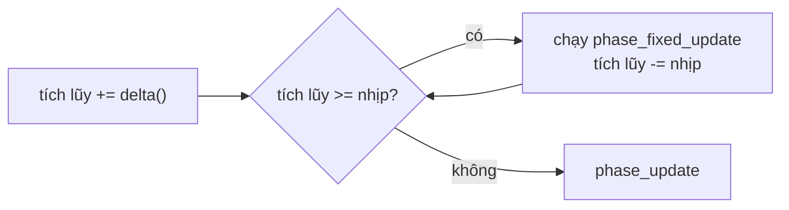

# Thời gian, fixed update, timer và tween {#time}

## Các loại thời gian

| Hàm | Trả về | Bị tốc độ và tạm dừng ảnh hưởng |
|---|---|---|
| njin::delta() | Thời gian của frame (giây) | Có |
| njin::delta_real() | Thời gian thật của frame | Không |
| njin::elapsed() | Thời gian từ lúc mở game | Không |
| njin::fixed_delta() | Độ dài một nhịp cố định | Không đổi |

Hầu hết code dùng njin::delta(). Dùng njin::delta_real() cho thứ vẫn phải chạy khi game
dừng: menu tạm dừng, hiệu ứng UI.

## Tốc độ và tạm dừng

- njin::time_set_scale(): 1 là bình thường, 0.5 là chậm một nửa. Ảnh hưởng delta(), fixed
  update và animation sprite. Dùng cho slow motion.
- njin::time_set_paused(): njin::delta() về 0 và fixed update ngừng. **Mọi phase khác vẫn
  chạy**, nên input vẫn đọc được và menu vẫn vẽ được.

## Fixed update

`phase_fixed_update` chạy theo **nhịp cố định**, mặc định 60 lần mỗi giây
(`njin_cfg::fixed_hz`). Mỗi frame nó chạy 0, 1 hoặc vài lần tùy FPS, sao cho tổng số nhịp
khớp thời gian thật.



Trong phase này, njin::delta() trả về **đúng một nhịp**. Đặt **vật lý** ở đây: kết quả giống
nhau dù máy chạy 30 hay 144 FPS, và va chạm không bị xuyên qua khi FPS tụt.

Nếu một frame quá dài (ví dụ dừng ở breakpoint), phần dư quá 8 nhịp bị bỏ, để game không
phải chạy dồn hàng trăm nhịp một lúc.

njin::fixed_alpha() cho biết phần nhịp còn dư (0..1). Dùng để nội suy vị trí khi vẽ, cho
chuyển động mượt khi FPS cao hơn nhịp vật lý:

```cpp
const njin::vec2 draw_pos = njin::lerp(prev_pos, pos, njin::fixed_alpha(ctx));
```

## Timer và tween

@include time_tween.cpp

njin::timer đếm ngược rồi báo. `tick(dt)` trả về `true` đúng một lần khi hết giờ (hoặc mỗi
vòng nếu `repeat`). `progress()` cho tiến độ 0..1.

njin::tween chuyển mượt một giá trị (`f32`, `vec2` hoặc `rgba`) từ `from` đến `to` trong
`duration` giây, theo một đường cong njin::ease. `tick(dt)` trả về giá trị hiện tại.

| Đường cong | Cảm giác |
|---|---|
| `linear` | Đều, máy móc |
| `out_quad`, `out_cubic` | Giảm tốc khi đến đích: tự nhiên nhất cho UI |
| `in_out_sine` | Mềm cả hai đầu: chuyển camera |
| `out_back` | Vượt quá rồi quay về: bảng bật ra |
| `out_bounce` | Nảy như quả bóng rơi |
| `out_elastic` | Rung như lò xo |

Timer và tween là struct thường, không phải component. Giữ chúng ở đâu tùy bạn: trong
component, trong biến của module.
