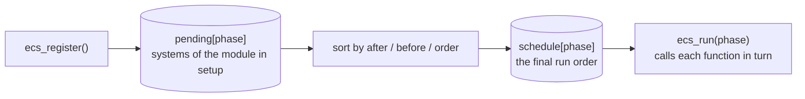

# Internal architecture {#architecture}

This page is for people who want to understand or modify the engine. If you only want to make games, you do not need to read it.

## Two layers

```
src/engine/
  api/       public headers, declarations only. Games include njin.h
  runtime/   the implementation. Uses raylib. Games do not see it
```

**raylib is completely hidden**: the headers in `api/` do not include raylib. The
`to_raylib` and `from_raylib` functions (files `njin2rl` and `rl2njin`) convert back and forth between njin's
types (`vec2`, `rgba`...) and raylib's types. That way games only depend on
`njin::api`, and raylib is an implementation detail of `njin::rt`.

## njin_ctx

njin::njin_ctx is a struct that is **opaque** to the game: use it only through functions. The real definition
lives in `runtime/njin_ctx_impl.h`:

| Member | Role |
|---|---|
| `cfg` | The configuration passed to njin_create() |
| `time` | Time, speed, pause, the fixed update accumulator |
| `random` | The shared random number generator |
| `window` | Opens the window and audio device on creation, closes them on destruction |
| `input` | Key state of the previous and current frame, the action list |
| `shader`, `texture`, `render_texture` | The GPU resource stores |
| `font` | Font store |
| `audio` | Audio store: sound and music |
| `post` | The off-screen image of the post-processing shader (camera module) |
| `sprites` | The baked images of tilemap chunks (sprite module) |
| `scene` | The scene list, the current scene and the switch request |
| `ecs` | Registry, dispatcher and system schedule, plus per-system timing when an inspector is attached |
| `view` | Virtual screen: a small fixed image scaled up to the window (see @ref screen_timers) |
| `timers` | Running timers and tweens |
| `dialog`, `i18n` | The open dialog; the string tables of the languages (see @ref dialog) |

The declaration order matters: members are destroyed in **reverse** order, and `window`
is declared before the stores, so it closes **last**. The stores free GPU resources and audio buffers while the OpenGL context and audio device are still alive. The audio
device is opened with the window and closed in the destructor of `window`.

## Stores and handles

`shader_store`, `texture_store`, `render_texture_store` and `audio_store` share one mold:

- Each resource sits in a **slot** of a `std::vector`.
- A handle has `id = slot index + 1`. So `id == 0` is always invalid.
- A slot is **never reused** after unloading. An old handle therefore cannot point to a new resource by mistake.
- The store's destructor frees every live slot.
- Stores cannot be copied, because copying would free the same GPU resource twice.

## The system schedule



`ecs_store` (file `runtime/njin_ecs.h`) keeps two arrays per phase:

- `pending`: the systems of the module that is **currently** running `setup`.
- `schedule`: the final order of every registered module.

When njin_mod_register() is called:

1. Turn on the `in_setup` flag so ecs_register() knows it is being called legitimately.
2. Call the module's `setup`. Each ecs_register() pushes into `pending[phase]`.
3. For each phase, sort `pending` then **append it to the end** of `schedule`, then clear `pending`.

Because step 3 appends to the end, the module registered first runs first.

**The sort** is a topological sort: take the systems not yet blocked by an `after`/`before` constraint,
pick the one with the smallest `order` (ties go by registration order), put it into the
result, remove its constraints, and repeat. If systems remain but none can be picked, there is a dependency cycle: log an error
and append the rest in registration order.

`ecs_run(phase)` is just a `for` loop calling each function in `schedule[phase]`.

## Core modules

njin_create() registers the core modules before returning, in `runtime/modules/`,
in this order:

| Module | What it does |
|---|---|
| `njin.reload` | Reloads textures and shaders whose files just changed, when hot reload is on (see @ref rendering) |
| `njin.debug` | When the debug port is on: receives njin_inspector's commands at the start of the frame, sends stats at the end (see @ref debug) |
| `njin.dialog` | Drives the open dialog: text reveal, choices, advancing lines (see @ref dialog) |
| `njin.ui` | Reads keyboard, mouse and gamepad for the UI, moves the selection, holds the navigation keys while a menu is shown, blocks widgets behind a popup; toasts are drawn at the end of the frame (see @ref ui) |
| `njin.camera` | Turns the camera on (with shake) before any draw command; runs post-processing (see @ref camera, @ref post_processing) |
| `njin.audio` | Feeds the music streams, restarts looping sounds (see @ref audio) |
| `njin.hierarchy` | Computes child entities' transforms from their parent (see @ref prefabs) |
| `njin.anim` | Runs njin::animator: state transitions, frame changes (see @ref animation) |
| `njin.particles` | Spawns, moves and removes particles (see @ref particles) |
| `njin.sprite` | Runs njin::sprite_anim, sprite flashing, bakes tilemap chunks, draws sprites, tilemaps and particles by layer (see @ref sprites, @ref tilemap) |
| `njin.camera_follow` | Brings the camera to its target: lag, dead zone, lookahead, clamped inside the level frame (see @ref platformer) |
| `njin.collision` | Finds colliders touching each other, sends events; draws outlines when debugging is on (see @ref collision) |
| `njin.body` | Drives njin::platformer_body, njin::topdown_body and njin::path_mover in `phase_fixed_update` (see @ref platformer, @ref topdown) |
| `njin.timer` | Runs timers and per-entity tweens in `phase_update` (see @ref screen_timers) |

Because they are registered **before** the game's modules, their systems run first within the same
phase. The camera module relies on this to turn the camera on before any of the game's draw commands;
hierarchy runs before anim, particles and sprite so they see this frame's new positions.

## Adding a core module

1. Create `runtime/modules/<name>.cpp` and `.h`, declaring a function that returns a njin::mod_desc.
2. Call njin_mod_register() for it in `register_core_modules()` (`runtime/modules/core_modules.cpp`).

CMake automatically finds every `.cpp` file under `runtime/`, so there is no file list to edit.
