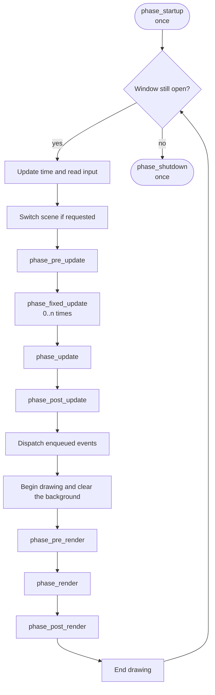

# The game loop {#game_loop}

run() runs the following loop:

## The start of each frame

Before the first phase, the engine:

1. Updates time: delta() is the previous frame's time (already multiplied by the speed, 0 when
   paused), elapsed() is the time since the window opened. See @ref time.
2. Reads the input state (see @ref input). This state does **not change** for the whole frame.
3. Switches scene if the previous frame called scene_set() (see @ref scenes).

## The update group

`phase_pre_update`, `phase_update`, `phase_post_update` are where you put logic. The usual
split:

- **pre_update**: read input, prepare data
- **update**: main logic, movement, collision
- **post_update**: work that depends on the result of update, for example the camera following the player

Right after `phase_post_update`, events queued with `events(ctx).enqueue`
are dispatched (see @ref ecs).

## The render group

`phase_pre_render`, `phase_render`, `phase_post_render` run between the start and
end of drawing. The engine's camera module splits them into two spaces:

| Phase | Space | Affected by the camera |
|---|---|---|
| `phase_pre_render` | World | Yes |
| `phase_render` | World | Yes |
| `phase_post_render` | Screen | No |

So: draw characters and maps in `phase_render`; draw the UI in `phase_post_render` so the
camera does not shift or zoom it. See @ref camera.

## Startup and shutdown

- `phase_startup` runs **once**, after the window has opened and before the first frame. This is where you
  create entities, load textures and shaders, and bind keys.
- `phase_shutdown` runs **once** after the window closes.

Resources (textures, shaders, render textures, sounds, music) are freed automatically when you call
destroy(), so you are not required to unload them in `phase_shutdown`.
