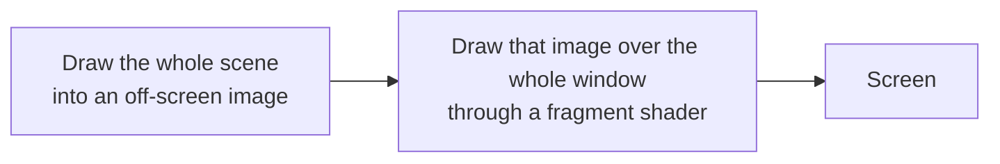

# Lesson 12: Common shader patterns {#learn_shader_patterns}

**What this lesson teaches:** the shader patterns 2D games use most: post-processing (dark vignette, CRT stripes, blur), white
flash, palette swap, dissolve, an outline around a character, keeping pixel art sharp, ripples; how they map to
what njin already has, and a few practical rules for writing small, correct and cheap shaders.

**What you need to know first:** @ref learn_shader_start : basic GLSL, uniforms, and how to run the playground
(`learn_shader_playground.c`). Every example here runs in that playground; the mode key is given at the start of each example.

## Two places a shader runs

There are two ways to use one, and they differ in **what the shader sees in `texture0`**:

| Kind | `texture0` is | Playground | Used for |
|---|---|---|---|
| On a sprite | That sprite's image | Mode 2 | White flash, outline, dissolve, recoloring a character |
| On the whole scene | The whole finished frame | Mode 3 | Dark vignette, CRT, blur, pixelating the whole screen |

### Why post-processing must draw the scene into an image first

The GPU draws objects into the frame one at a time; while it draws an object, the shader only knows **that object's** data. There is no way for a
shader to "look at" the scene already drawn in order to blur it or darken its edges. The way to do it:

Now `texture0` **is** the whole scene, so the shader can read the color of any point, including the neighbouring ones. Mode 3
of the playground does exactly this: it draws the scene into an off-screen image, then draws that image through the shader. Because the off-screen
image is stored upside down, the playground draws it with a **negative** height (see the `-450` line in the code).

## Post-processing

### Dark vignette

@include learn_shader_vignette.fs

@image html learn_shader_vignette.png "Mode 3. Left: the original scene. Right: dark vignette, 70% strength (mouse.x = 0.7). Dark in the four corners, the middle unchanged."

`distance(fragTexCoord, vec2(0.5))` is the distance to the center: 0 in the middle, about 0.7 at a corner. `1.0 - smoothstep(0.30, 0.80, d)`
gives 1 in the middle, falling off toward the edges; multiplied into the scene color, the edges get darker. `mix(1.0, light, mouse.x)` is the "knob": 0 is
no darkening, 1 is full darkening.

### Horizontal stripes and a tint (CRT style)

@include learn_shader_scanlines.fs

@image html learn_shader_scanlines.png "Mode 3, cropped tight around the character and enlarged. Left: original. Right: gray tinted green with horizontal stripes, like an old monochrome screen."

Two steps combined: turn it gray (`dot`) and multiply by a color (`vec3(0.4, 1.0, 0.5)`) to tint it; then multiply by a factor
`0.85 + 0.15 * sin(row * 3.14159)` that changes with the **pixel row** (`fragTexCoord.y * resolution.y`) to make stripes: every other
row is slightly darker. `resolution` is needed to turn the 0 to 1 coordinate into a real row number.

### Blur

@include learn_shader_blur.fs

@image html learn_shader_blur.png "Mode 3, cropped around the character and enlarged. Left: original. Right: after blurring with a radius of about 4 pixels (mouse.x = 0.7)."

The idea: the new color is the **average** of the surrounding pixels. Here it is a 3 x 3 grid (9 image reads), spaced
`radius` pixels apart; `texel = 1.0 / resolution` is "one pixel" in image coordinates, to multiply by the number of pixels you want to jump.

A real bug I hit while writing this lesson: the first version **had no `clamp` line**, and along the top and bottom edges of the frame there was a band
of odd color (ground color mixed into the sky). The cause is that pixels at the edge need to read "outside the image", and raylib **repeats the image** by default,
so it picks the wrong color from the **opposite** edge. The fix is `clamp` to keep the coordinates inside the image. But `clamp(..., 0.0, 1.0)` is still not enough: reading
exactly at `0.0` or `1.0` with the smooth (bilinear) filter still blends with the other edge; you must leave **half a pixel**:
`clamp(p, texel * 0.5, 1.0 - texel * 0.5)`. Both ways were tried and the colors at the edge measured: only the half-pixel version gives the same
colors as the original image.

**Cost.** Each pixel reads 9 times. A larger radius means reading more points, or jumping farther and seeing more visible "steps".
The common approach is to **split it into two passes**: one pass blurs horizontally, one blurs vertically. A horizontal 3-point blur followed by
a vertical 3-point blur gives the same result as a 3 x 3 grid but costs only `3 + 3 = 6` reads instead of `3 x 3 = 9`; the larger the radius,
the bigger the saving (an `n x n` grid costs `n * n`, two passes cost `2 * n`). njin blurs this way:
each pass is one side of a 9-point Gaussian filter, and the large blur runs at **half resolution** (touching only a quarter
of the pixels), see @ref post_processing.

### Why combine into one pass

Vignette, stripes and tint all need only **the current pixel**, so they go into the same shader and are drawn **once**:

@include learn_shader_answer_crt.fs

A full-screen draw pass has a cost, counted in pixels. Three shaders in a row cost three passes; combined they cost one. That is why
njin combines almost all effects into one shader (an "uber shader") and keeps only blur and bloom separate, the effects that need to read
neighbouring pixels. This is also exercise 1 at the end of the lesson.

## On a sprite

### White flash on hit

@include learn_shader_flash.fs

@image html learn_shader_flash.png "Mode 2. Left: the original character. Right: 70% white flash. The shape stays the same, the background stays transparent."

Blend the pixel color toward white, **keeping alpha**: transparent parts stay transparent, so the sprite lights up exactly along its shape. Note
that this is `mix`, not multiplication: multiplying by a color gives a color **darker than or equal to** the original (because each channel of
the tint color is from 0 to 1), so it can never make a sprite light up to white.

### Palette swap by brightness

@include learn_shader_palette.fs

@image html learn_shader_palette.png "Mode 2. Left: original. Right: after mapping brightness through a three-color palette of dark, pink, cream."

Compute the brightness of the source pixel, then use it as an index into a **palette** written with `mix`. Dark, medium, light become three colors you pick. This
suits changing a sprite's style (night time, poisoned, frozen) without drawing extra images. It is not a palette swap by
*index* like real 8-bit games (each pixel is a number looked up in a table), but it is the same idea, and enough
for most needs.

### Dissolve

@include learn_shader_dissolve.fs

@image html learn_shader_dissolve.png "Mode 2. Left: original. Right: dissolving, about three quarters of the pixels gone, the remaining edge glowing orange."

Each source pixel is given a fixed random number with a `hash` function; it is a common trick: `fract(sin(dot(p, vec2(12.9898, 78.233))) * 43758.5453)`
gives a number between 0 and 1, and the same input always gives the same result (njin uses this very function for the grain noise
of its post-processing). The coordinates are rounded down to the pixel cell (`floor(fragTexCoord * textureSize(...))`) so the pieces are square and match
the pixel art grid. Then that number is compared with a **threshold** `t`: if it is smaller, `discard` (drop the pixel, draw nothing). Raising the threshold from 0 to
1 makes the image dissolve gradually. The narrow band just above the threshold is painted orange to look like burning.

Replace `n = hash(cell)` with some other quantity for a different kind of dissolve: using the position makes it dissolve in a direction (exercise 3).

### Outline around a character

@include learn_shader_outline.fs

@image html learn_shader_outline.png "Mode 2. Left: original. Right: with a yellow outline one source pixel thick, wrapping the hat and both feet."

For each pixel, read the opacity of the 4 neighbouring pixels. If the **current pixel is transparent** but has an **opaque** neighbour, it lies just outside
the edge: paint the outline color. Note: because the shape is only drawn inside the image's frame, you must leave a **transparent margin** of at least one pixel around the character,
otherwise the pixels outside the frame are never run through the shader to paint the outline, and the outline gets cut off at the image edge.

### Keeping pixel art sharp, and pixelating

Enlarged pixel art must keep every pixel square. The usual way is to pick the **point** (nearest) filter; but when the image is
drawn with the **smooth** (bilinear) filter, or rotated, or placed at fractional coordinates, the edges blur. A shader can fix that:

@include learn_shader_crisp.fs

@image html learn_shader_crisp.png "Mode 2 with the smooth filter. Left: blurred edges when enlarged. Right: same filter but with this shader, sharp edges."

The coordinate `fragTexCoord` is snapped to the **center** of a source pixel: `(floor(uv * size) + 0.5) / size`. Every read lands exactly
in the middle of a pixel, so the smooth filter has nothing left to blend.

The opposite of that, **pixelating** makes the image deliberately coarse (for an old-style scene, or a hit effect), with the same formula but with cells **larger** than
a source pixel:

@include learn_shader_pixel.fs

@image html learn_shader_pixel.png "Mode 3. Left: the original scene. Right: pixelated with 14-pixel cells (mouse.x = 0.7)."

`resolution / size` is the number of cells along each axis; round down to the cell, then sample at the cell's center: every pixel in a cell sees the same color.

### Ripples

@include learn_shader_wave.fs

@image html learn_shader_wave.png "Mode 3. Left: the original scene. Right: bent by a horizontal wave, taken at a fixed moment."

Shift the **read coordinate**, not the color: take the color from a spot slightly to the right or to the left. The shift is a `sin` wave
over `uv.y` that moves with `time`, so the whole scene sways as if under water or in heat haze. Every "bending" effect
(water, heat, shockwaves) is a variant of this trick: **recompute the coordinate, then read the image**.

### Showing a number as a color for debugging

@include learn_shader_debug.fs

@image html learn_shader_debug.png "Mode 2. Left: the character. Right: opacity as gray. White is fully opaque, black is transparent; the black square frame is the whole image."

When the outline does not show, or the dissolve looks wrong, the first step is to **look at the number itself**. This shader shows the alpha channel; one look tells you
"is this pixel really transparent" and "does the image leave a margin" (the black area around the character is that margin). The same approach works
for anything: `finalColor = vec4(vec3(x), 1.0)` shows `x` as gray; `vec4(uv, 0.0, 1.0)` shows the coordinates, as in the previous lesson.

## In njin

njin already has these. The mapping table, checked against the headers and the source code:

| Pattern in this lesson | In njin |
|---|---|
| Dark vignette, CRT stripes, pixelate, blur, tint, film grain... | njin::post_fx_set() with njin::post_fx: the fields `vignette`, `scanlines` and `scanline_size`, `pixelate`, `blur`, `tint`, `saturation`, `grain`... No shader to write. See @ref post_processing |
| Combining several effects into one pass | Already done: effects that need only the current pixel are combined in one shader, `blur` and `bloom` are separate passes (header `njin_post.h`) |
| Your own post-processing shader | njin::camera_set_post_shader(): draws the whole world through that shader, **last** in the chain of built-in effects. UI in `phase_post_render` is not affected |
| Sprite dissolve | njin::sprite_dissolve() and njin::dissolve_fx: the same idea as `learn_shader_dissolve.fs` in this lesson (a noise threshold swept from 0 to 1, a burning rim at the edge), but the random numbers are computed with a hash function so no noise image is needed. See @ref particles |
| Sprite white flash | njin::sprite_flash(). Its shader (`flash_fs` in `fx.cpp`) does exactly what this lesson does: `mix(c.rgb, flashColor.rgb, flashColor.a)`, keeping `c.a` |
| Your own shader on a sprite or object | njin::shader_load(), njin::shader_set_f32(), njin::shader_set_vec2(), then njin::shader_begin() and njin::shader_end() around the draw calls. Set uniforms **before** `shader_begin` |
| Editing shaders while the game runs | njin::hot_reload_enable(). A shader with **a compile error keeps the old version** and logs it, like the playground. Best turned on in debug builds |

Because njin and the playground both use GLSL 330 and the same names defined by raylib (`fragTexCoord`, `texture0`,
`colDiffuse`), **shader files need no changes**. The only difference: the uniforms the playground passes in by itself (`time`,
`resolution`, `mouse`) you now have to set yourself with njin::shader_set_f32() and njin::shader_set_vec2(). Tried: loading
`learn_shader_vignette.fs` unchanged with njin::shader_load(), setting `mouse` with njin::shader_set_vec2(), then turning it on with
njin::camera_set_post_shader(): the dark vignette shows up in the four corners of the scene.

## Practical advice

- **One job per shader, and keep it short.** A short shader is easy to read, easy to debug, and cheap to run. If you need three effects, combine them in one
  shader if they only need the current pixel (as in exercise 1), split them if they need to read neighbouring pixels.
- **Prefer `mix`, `step`, `smoothstep`, `clamp` over `if`.** The GPU runs many pixels at once in groups; when the pixels in one
  group take two different branches, the GPU often has to run both branches. Instead of `if (x > 0.5) c = a; else c = b;`, write
  `c = mix(b, a, step(0.5, x));`. Exercise 2 is an example (`step` as a switch).
- **Cost grows with the number of pixels covered and the number of image reads.** A shader on the whole screen runs for every pixel; on a small sprite
  only for the sprite's pixels. Every extra `texture()` is one more memory read for **each pixel**: the blur radius and the number of
  sample points are the first things to weigh.
- **One uniform per knob, with a clear name.** `amount`, `radius`, `time`. Do not cram two meanings into one `vec4`. Uniforms that change every frame must
  be set again every frame.
- **Keep alpha when you only change color.** Return `vec4(rgb, c.a)`. Forget it and the sprite's transparent parts become opaque (or black).
- **Watch the image edges.** Reading outside 0 to 1 makes raylib repeat the image; see the blur section above about `clamp` and half a pixel.
- **Debug by showing values as colors**, like the shader `learn_shader_debug.fs`.
- **Test on a weak graphics card if you have one** (an integrated card). A weak card exposes the cost earliest: an effect that runs smoothly on a dedicated card can
  stutter on an integrated one, and you see it before the players do. All the screenshots in these two lessons come from an integrated
  card (Intel Iris Xe).
- **Do not trust a single driver.** Error messages and the handling of some vague corners of GLSL differ between vendors
  (see the previous lesson: the error messages there are Intel's). Keep shaders close to the standard: write `1.0`, do not lean on
  undefined behaviour (such as `smoothstep` with reversed arguments).

## Self-check

1. Why must a full-screen effect first draw the whole scene into an off-screen image, and only then draw that image through the shader?
2. Why does "white flash" use `mix` toward white and not color multiplication?
3. In the outline shader, why is the condition "the current pixel is transparent **and** has an opaque neighbour", and not just "has an opaque neighbour"?
4. `learn_shader_crisp.fs` and `learn_shader_pixel.fs` both round coordinates. How do they differ, and when do you use each?
5. `clamp(p, 0.0, 1.0)` still leaves a band of odd color at the edge when blurring. Why, and how do you fix it?

## Exercises

1. Write **one shader** (mode 3) with a vignette and horizontal stripes, no tint. Why does combining them make sense?
2. Make the white flash **blink by itself** 4 times per second with `time`, without using `if`.
3. Change `learn_shader_dissolve.fs` so the character dissolves **from top to bottom**: the head goes first, the feet last.

## Answers

**Self-check.**

1. While drawing an object, the shader only sees that object's data. Drawing the scene into an image first makes `texture0` the whole scene,
   so the shader can read the color of any point, including the neighbouring ones (needed for blur, and for every effect on "the whole frame").
2. A tint color has channels between 0 and 1, so multiplication can only keep or darken the original color; it cannot turn orange into white.
   `mix(c.rgb, vec3(1.0), t)` pulls the color toward white.
3. If you only check for an opaque neighbour, the pixels **inside** the character also have opaque neighbours and get outlined. The condition
   "it is itself transparent" limits the outline to just outside the edge.
4. Both round the coordinate to a cell center. `crisp` uses cells **the size of one source pixel** to keep the image sharp when it is smooth-filtered or enlarged;
   `pixelate` uses **larger** cells to make the image coarse on purpose. Use `crisp` to cure blur, `pixelate` to create an effect.
5. Reading exactly at `0.0` or `1.0` with the smooth filter and repeat mode, the filter still blends the edge point with the point on the other edge.
   Fix: leave half a pixel, `clamp(p, texel * 0.5, 1.0 - texel * 0.5)`.

**Exercise 1: vignette and stripes in one pass.**

@include learn_shader_answer_crt.fs

Both need only the current pixel, so they multiply into the color together in one shader. One full-screen draw pass instead of two. Run mode 3: a dark vignette
in the four corners and thin horizontal stripes across the whole scene.

**Exercise 2: blinking by itself.**

@include learn_shader_answer_blink.fs

`fract(time * 4.0)` runs from 0 to 1 four times per second; `step(0.5, ...)` turns it into a signal alternating 0 and 1. Two frames captured at two different
moments: the pixel in the middle of the character's body is orange `(240, 150, 50)` in one and white `(255, 255, 255)` in the other.

**Exercise 3: dissolving from top to bottom.**

@include learn_shader_answer_dissolve_up.fs

The number `n` is no longer random but `fragTexCoord.y`: 0 at the head, 1 at the feet. As the threshold `t` rises, pixels with a small `n` (at the top) disappear
first. Run mode 2 with `mouse.x = 0.7`: only the feet remain, with a bright orange rim on top of what is left.

## Next steps

@ref learn_game_patterns : design patterns in game programming (the loop, states, events, ECS) and how they
appear in njin.
