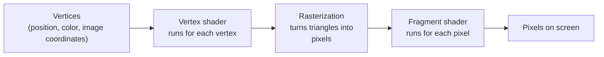

# Lesson 10: Shaders: getting started with GLSL {#learn_shader_start}

**What this lesson teaches:** what a shader is, how the GPU runs it, just enough of the GLSL language, and how to write, run and fix
a fragment shader in a small raylib "playground".

**What you need to know first:** how to read and run a simple C program (@ref learn_c_start) and how to build a CMake
project with raylib (@ref learn_cmake_projects). You do not need to know anything about graphics or math yet.

This lesson does not use njin: only raylib. njin uses exactly this kind of shader, and the end of the lesson has an "In njin"
section that shows where they plug into the engine.

## How the GPU differs from the CPU

A CPU has few cores (a few to a few dozen); each core can do anything, fast and flexibly. A GPU has **a great many small
compute units** (hundreds to thousands, depending on the card); each one is much simpler, but they run **the same
program** on many pieces of data at once. Drawing one 800 x 450 frame is 360,000 pixels; there is no single core painting them one by one. The GPU splits
the work among its units, and each time a group of pixels has its colors computed together.

That small program is a **shader**. You write it once; the GPU runs it for every pixel (or every vertex), in
parallel. Consequences to remember right away:

- Each run of the shader sees only **its own pixel**. It does not know what color the pixel next to it has, unless
  you read it from an image (a texture).
- The runs **do not talk to each other** and do not write into each other. There is no shared variable updated step by step as
  in a C loop.
- So shaders tend to be short, and the way of thinking is different: not "loop over every pixel" but "given a pixel at this
  position, what is its color?"

## The drawing pipeline in one picture



- A rectangle is drawn as **two triangles**, that is 4 vertices. Each vertex carries a position, a color and **image coordinates**
  (where it sits on the texture).
- The **vertex shader** runs for each vertex and decides where that vertex lands on the screen.
- **Rasterization** (the GPU does it, you do not write it) finds every pixel inside the triangle, and **interpolates** the data
  of the three vertices for each pixel: a pixel halfway along an edge gets the value halfway between.
- The **fragment shader** (also called a pixel shader) runs for each of those pixels and returns the **final color**.

Most 2D effects live in the fragment shader, so this lesson only writes that kind. raylib has a default vertex shader
that takes care of the rest.

## GLSL in 10 minutes

GLSL is the shader language, close to C. This is the shortest useful shader:

@include learn_shader_solid.fs

@image html learn_shader_solid.png "Every pixel the same orange: this is the result of learn_shader_solid.fs."

Line by line:

| Line | Meaning |
|---|---|
| `#version 330` | The GLSL version. raylib and njin on desktop use 330 (OpenGL 3.3). It must be the first line |
| `out vec4 finalColor;` | The shader's output: a color. `finalColor` is a name you choose; there just has to be exactly one `out vec4` |
| `void main()` | Runs once for each pixel |
| `vec4(1.0, 0.5, 0.2, 1.0)` | A color (red, green, blue, opacity). Each number from 0 to 1 |

### Data types

| Type | What it is |
|---|---|
| `float`, `int`, `bool` | Real number, integer, true/false. Real numbers need a decimal point: `1.0`, not `1` |
| `vec2`, `vec3`, `vec4` | Vectors of 2, 3, 4 reals: coordinates, colors |
| `sampler2D` | An image (texture) to read colors from |
| `mat4` | A 4 x 4 matrix. Used in vertex shaders to transform positions; this lesson rarely needs it |

Vectors can be written in many ways:

@code{.glsl}
vec3 c = vec3(1.0, 0.5, 0.2);
vec4 d = vec4(c, 1.0);       // combine: a vec3 and a number into a vec4
vec3 e = c * 0.5;            // multiply all three components by 0.5
vec3 f = c + vec3(0.1);      // vec3(0.1) has all three components set to 0.1
float r = c.r;               // take one component: .r .g .b .a (or .x .y .z .w)
vec2 g = c.xy;               // take the first two components: this is called a "swizzle"
vec3 h = c.bgr;              // reverse the order
vec3 k = c.xxx;              // repeat one component
@endcode

An operation between two vectors works **component by component**: `a * b` is `vec3(a.x*b.x, a.y*b.y, a.z*b.z)`.

### Built-in functions

Enough for most effects:

| Function | What it does |
|---|---|
| `mix(a, b, t)` | Blend: `a` when `t = 0`, `b` when `t = 1`, a mix in between. Used for almost everything |
| `clamp(x, lo, hi)` | Force `x` into the range `[lo, hi]` |
| `step(edge, x)` | 0 if `x < edge`, otherwise 1. A "switch" without an `if` |
| `smoothstep(e0, e1, x)` | 0 when `x <= e0`, 1 when `x >= e1`, a smooth transition in between. Requires `e0 < e1` |
| `length(v)`, `distance(a, b)` | Length of a vector, distance between two points |
| `dot(a, b)` | Dot product: multiply each pair of components, then add them up. With weights `vec3(0.299, 0.587, 0.114)` it gives the brightness of a color |
| `sin`, `cos` | Waves. The input is in radians |
| `fract(x)`, `floor(x)` | Fractional part, integer part (rounded down) |
| `min`, `max`, `abs` | As the names say |
| `texture(tex, uv)` | Read a color from image `tex` at coordinate `uv` |

### `in`, `out`, `uniform`

| Keyword | Meaning | Example |
|---|---|---|
| `in` | Data coming in from the previous stage, **different for each pixel** (interpolated) | `in vec2 fragTexCoord;` |
| `out` | The result of this shader | `out vec4 finalColor;` |
| `uniform` | Data from the C program, **the same value for every pixel** in that draw | `uniform float time;` |

raylib fills in a few names for you; get one wrong and the shader receives no data:

| Name | What it is |
|---|---|
| `fragTexCoord` (`in vec2`) | This pixel's image coordinate, interpolated from the vertices |
| `fragColor` (`in vec4`) | The draw's tint color (the `tint` parameter of the draw functions) |
| `texture0` (`uniform sampler2D`) | The image being drawn |
| `colDiffuse` (`uniform vec4`) | The material's tint color, usually white |

### How it differs from C

- No recursion: a function may not call itself. Try it and you will get a *link* error,
  not a compile error: see the errors section below.
- No `printf`, no logging. To find out what a value is, show it as a color.
- No pointers, no memory allocation. Arrays have a fixed size at compile time.
- Integers and reals are two different types: `1` and `1.0`. On the card tested, `float x = 1;` still compiles,
  but in other GLSL versions (OpenGL ES) it does not. Always write `1.0` for reals.
- Precision: in GLSL 330 (desktop) every `float` is 32 bits and you do not need to declare anything. Web and mobile use
  OpenGL ES, where you must declare `precision`; njin only targets GLSL 330, so this lesson does not cover it.

## Coordinates and colors

- **Colors** go from 0 to 1 per channel, not 0 to 255. `vec3(1.0, 0.5, 0.2)` is orange.
- **Image coordinates** `fragTexCoord` run from 0 to 1 across the image being drawn. In raylib, `(0, 0)` is the **top left** corner
  of the image and `(1, 1)` the bottom right. Try it now:

@include learn_shader_gradient.fs

@image html learn_shader_gradient.png "Top left black (0, 0), top right red, bottom left green, bottom right yellow. So x grows to the right and y grows downward."

Red follows `x`, green follows `y`: the colors in the four corners tell you the coordinate system. This is also the first
debugging trick to remember: **when you are not sure what a number means, show it as a color**.

### Circles and aspect ratio

`fragTexCoord` always goes 0 to 1 along both axes, but an 800 x 450 window is not square. Draw a circle in these coordinates
without correcting for that and you get an ellipse. You need to know the window size, and that is a job for a uniform.

## Uniforms: the C program talks to the shader

A shader does not know the time, the window size or the mouse position by itself. The C program **sets** them in uniforms before
drawing (this is the real code from the playground below):

@code{.c}
float time = (float)GetTime();
SetShaderValue(shader, GetShaderLocation(shader, "time"), &time, SHADER_UNIFORM_FLOAT);
@endcode

`GetShaderLocation` finds the "slot" named `time` in the shader; `SetShaderValue` writes the value into that slot.
If the shader does not declare that uniform, `GetShaderLocation` returns -1 and `SetShaderValue` does nothing, and
raylib logs no warning (tried: the example `learn_shader_solid.fs` has no uniforms and the log is clean). Thanks to that,
one C program shared by many different shaders still works. A value stays as it is until you
set it again, so uniforms that change over time are set again **every frame**.

## The playground

The playground is a small C program using raylib. It loads a fragment shader file, draws it on the window, gives
the shader three uniforms (`time`, `resolution`, `mouse`), and **reloads the shader by itself when the file changes**: you edit the
shader in your editor, save, and see the result immediately, without restarting the program. A broken shader
keeps the old version, and the log shows the error.

@include learn_shader_playground.c

Build it as a CMake project with raylib (@ref learn_cmake_projects): use this file as `main.c`. Run it in a
folder that contains `shader.fs`:

```
playground shader.fs
```

| Key | What it does |
|---|---|
| 1 | Mode 1: an image stretched over the whole window, `fragTexCoord` runs 0 to 1 across the window. For shaders that make their own shapes |
| 2 | Mode 2: a small 48 x 48 character scaled 6 times in the middle of the window, transparent background. For shaders on sprites |
| 3 | Mode 3: a small scene (sky, ground, tree) drawn into an off-screen image, then shown through the shader. For full-screen effects |
| F | Toggle the image filter: point (nearest, sharp edges) or smooth (bilinear) |
| R | Reload the shader now |

| Uniform | Value |
|---|---|
| `time` | Seconds since start |
| `resolution` | Window size in pixels: `vec2(800, 450)` |
| `mouse` | Mouse position, 0 to 1 along each axis. `mouse.x` is the handiest "knob" |

Two extra parameters, for automatic screenshots: `playground shader.fs 2 shot.png 30` runs mode 2, takes a screenshot
after 30 frames and quits, with the mouse fixed at `(0.7, 0.5)`. Add a `1` at the end to use the smooth filter.

Every image in this lesson was taken with the program above, on an Intel Iris Xe graphics card (as the raylib log
reports). Before/after images were cropped and placed side by side with an image editor.

## Five exercises to try

Each one is a `.fs` file; copy it into `shader.fs` (or run it directly) and press the mode key given below.

### 1. One color

Already seen above, `learn_shader_solid.fs`, mode 1. Change the four numbers and press R.

### 2. Gradient

`learn_shader_gradient.fs` above, mode 1. Try `vec4(fragTexCoord.y, fragTexCoord.x, 0.0, 1.0)`
and guess beforehand what the image will look like.

### 3. Circle

@include learn_shader_circle.fs

@image html learn_shader_circle.png "A yellow circle, its edge slightly soft thanks to smoothstep."

Mode 1. Three key ideas: move the center to `(0, 0)` with `fragTexCoord - 0.5`; multiply by the aspect ratio to get a circle instead of an
ellipse; `smoothstep` gives a smooth edge (`step` instead gives a jagged edge). Note `1.0 - smoothstep(0.28, 0.30, d)`:
the first argument must be smaller than the second, so to get "1 inside, 0 outside" invert the result, not the arguments.

### 4. Colors that move with time

@include learn_shader_time.fs

@image html learn_shader_time.png "One frame of a constantly changing palette. Taken at a fixed moment; when it really runs, the colors drift."

Mode 1. `cos` gives a wave from -1 to 1; `0.5 + 0.5 * cos(...)` brings it to 0 to 1. The three channels are out of phase `(0, 2, 4)`, so
each channel lights up at a different moment, making a band of colors. The same formula with a constant `time` is a still image:
`time` is exactly the bridge between "picture" and "motion".

### 5. Reading an image and making it gray

@include learn_shader_gray.fs

@image html learn_shader_gray.png "Left: the original character. Right: after the shader, 70% gray (mouse at 0.7)."

Mode 2. `texture(texture0, fragTexCoord)` takes the image's color at this pixel. `dot(c.rgb, vec3(0.299, 0.587, 0.114))`
computes the brightness the human eye perceives: the eye is most sensitive to green and least to blue, so the three weights differ. `mix`
blends between the original color and gray by `mouse.x`; **the alpha channel stays as it is** (`c.a`) so transparent parts stay transparent.
This is also the `gray.fs` shader in @ref rendering, give or take one uniform.

## When a shader breaks

A shader is compiled **when the program runs**, by the graphics card's driver, not at build time. Errors only
show up at load time, and they are in the log. The common sign: **an empty window** (only the background color), because a broken shader
cannot draw anything.

Here are three real errors, reproduced in the playground. The messages are written by the driver, so the wording may differ on other cards;
the examples below come from an Intel Iris Xe.

**A misspelled variable name** (`fragTexCoords` instead of `fragTexCoord`, on line 7):

@include learn_shader_error_typo.fs

```
WARNING: SHADER: [ID 4] Failed to compile fragment shader code
WARNING: SHADER: [ID 4] Compile error: ERROR: 0:7: 'fragTexCoords' : undeclared identifier
ERROR: 0:7: 'x' : field selection requires structure, vector, or matrix on left hand side
```

Reading it: `0:7` means "source number 0, **line 7**". `undeclared identifier` is a name that was never declared. The second line is a
follow-on error caused by the first (if it does not know what `fragTexCoords` is, it cannot take `.x` from it either): **always fix the first
error first**.

**A missing semicolon** (at the end of line 7):

@include learn_shader_error_semicolon.fs

```
WARNING: SHADER: [ID 4] Failed to compile fragment shader code
WARNING: SHADER: [ID 4] Compile error: ERROR: 0:9: '}' : syntax error syntax error
```

The real error is on line 7, but the driver reports `0:9` (the file only has 8 lines). The compiler only notices the missing `;` when it meets
the `}` on a later line, and the line number can be off by even more. The rule: **for syntax errors, look at the reported line and a few lines
just above it**, not only that line.

**Recursion** (a function calling itself):

```
WARNING: SHADER: [ID 5] Failed to link shader program
WARNING: SHADER: [ID 5] Link error: Function call recursion detected.
```

This time compiling **succeeds** but **linking** fails: `Failed to link`, not `Failed to compile`.
The GLSL specification forbids recursion. Replace recursion with a loop.

In the playground, saving a broken shader adds the line `Shader error (see the log above), keeping the old one.` to the log, and the window
keeps showing the last good version. Once you fix it, save again and it runs right away.

## In njin

njin's shaders are exactly this kind of shader. Compare:

| You write here | njin |
|---|---|
| `#version 330`, fragment shader, `fragTexCoord`, `texture0`, `fragColor`, `colDiffuse` | Exactly the same. See `gray.fs` in @ref rendering |
| `LoadShader(NULL, "shader.fs")` | njin::shader_load() with `nullptr` for the vertex shader |
| `SetShaderValue(shader, GetShaderLocation(shader, "amount"), ...)` | njin::shader_set_f32(), njin::shader_set_vec2()... |
| `BeginShaderMode(shader)` ... `EndShaderMode()` | njin::shader_begin() ... njin::shader_end() |
| Reload when the file changes (the playground does it itself) | njin::hot_reload_enable(), best turned on only in debug builds |

The lesson @ref learn_shader_sdf teaches how to draw shapes with formulas, and the lesson @ref learn_shader_patterns shows the common shader patterns
and which of njin's built-in effects each one matches.

## Self-check

1. Why can a fragment shader not "loop over the neighbouring pixels" like a `for` loop in C?
2. How do `fragTexCoord` and `time` differ in the way the shader receives their values (`in` or `uniform`)? Which one differs
   between pixels?
3. What is `d` after `vec3 c = vec3(1.0, 0.5, 0.2); vec3 d = c.bgr;`?
4. The window is empty after you edited a shader. What is the first thing you do?
5. Why is `smoothstep(0.30, 0.28, d)` wrong, and what is the right way to get "1 inside the circle, 0 outside"?

## Exercises

1. Change `learn_shader_circle.fs` to draw a **square** instead of a circle.
2. Make the circle **move back and forth** left and right with `time`.
3. Write a mode 2 shader that makes a **negative** of the character (inverted colors), keeping the opacity.

## Answers

**Self-check.**

1. Each run of the shader belongs to one pixel and runs in parallel with thousands of others; no run can
   "look" at another. To see a neighbouring pixel, read from an image (`texture`) at an offset coordinate.
2. `fragTexCoord` is `in`, different for each pixel (interpolated). `time` is `uniform`, one value for every pixel
   of the draw, set by the C program.
3. `d = vec3(0.2, 0.5, 1.0)`. The `.bgr` swizzle reverses the order: blue becomes the first component.
4. Open the log, find the `Compile error` or `Link error` line, read the **first** error, go to the reported line and
   look at a few lines above it too.
5. GLSL requires the first argument to be smaller than the second; swap them and the result is undefined. The right form is
   `1.0 - smoothstep(0.28, 0.30, d)`.

**Exercise 1: square.** Change the round distance into a "square" distance: the larger of `|x|` and `|y|`.

@include learn_shader_answer_square.fs

Points at the same `max(abs(x), abs(y))` from the center form a square. Run mode 1: a yellow square
in the middle (checked on the test machine).

**Exercise 2: back and forth.** Subtract a vector from `p` before computing the distance: the circle's center follows that vector.

@include learn_shader_answer_move.fs

`0.4 * sin(time * 2.0)` swings left and right around the middle of the window; change `0.4` to move wider, change `2.0` to go faster.

**Exercise 3: negative.**

@include learn_shader_answer_invert.fs

Mode 2: the red hat turns turquoise, the orange body turns blue, the brown feet turn light blue; the transparent background stays
transparent because `c.a` is kept.

## Next steps

@ref learn_shader_sdf : drawing shapes with distance (SDF): circles, boxes, combining shapes, health bars, glows, drop shadows.
Then @ref learn_shader_patterns : the common shader patterns (post-processing, white flash, outline, dissolve, pixel art) and how
they map to njin.
