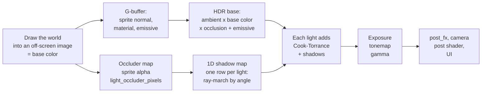

# 2D lighting (PBR) {#lighting}

njin has built-in **physically based (PBR)** 2D lighting: point lights, spot lights, directional lights, ambient light, soft shadows, normal maps, materials
(metallic, roughness, occlusion), emissive glow and tonemapping. Turn it on and the whole world, sprites and tilemaps alike, is lit, with no shader to write.

You should know first: @ref sprites, @ref camera and @ref ecs. Run `njin_render_demo` and press `L` to see everything below.
`njin_lighting_demo` puts each case in a room of its own (12 rooms: the kinds of light, `size` and soft shadows, the occluder
shapes, walls from a tilemap, shadows from sprites, PBR surfaces, colour and tonemapping, many lights, a side view platformer),
with what to look at and the line of code that makes it written on screen; each room is one function in
`src/games/lighting_demo/rooms_*.cpp`.

@image html render_light_night.gif "Night in the forest (njin_render_demo, key L): the character's torch flickers, four fixed lights, each tree trunk casts a pixel-exact shadow, flowers glow on their own. The golden ball is metal, so it reflects the lights differently from the wood and grass"

## What it is based on

| Part | Based on |
|---|---|
| The BRDF of each light: Lambert diffuse + Cook-Torrance specular (**GGX** distribution with `alpha = roughness^2`, **Smith-Schlick** occlusion with `k = (r + 1)^2 / 8`, **Fresnel-Schlick**, `kD = (1 - F)(1 - metallic)`) | `pbr.fs` in raylib's `shaders_basic_pbr` example: the same formulas, so art made for that example can be reused |
| Material maps with **MRA** channel layout: R metallic, G roughness, B ambient occlusion | The layout used in that example |
| **Per-pixel** shadows from sprite alpha: an occluder map, a 1D shadow map by angle, blurring by distance | The article [2D Pixel-Perfect Shadows](https://github.com/mattdesl/lwjgl-basics/wiki/2D-Pixel-Perfect-Shadows) by mattdesl, with PCSS-style penumbra estimation added |
| Shadows from **polygons** (any shape, thin walls, tilemap tiles), with an exact penumbra | The shadow volume idea from raylib's `shapes_top_down_lights` example; the penumbra follows Scott Lembcke's [2D Lighting with Soft Shadows](https://www.slembcke.net/blog/SuperFastSoftShadows/): each edge hides an interval of the light's diameter, worked out as an area, not sampled |

Lighting is computed in **linear space, 16-bit HDR**: the sprite image (sRGB) is converted to linear before computing, the lights are summed, then exposure, tonemap and gamma
bring it to the screen. It differs from raylib's `pbr.fs` in three ways, all giving more correct results: albedo is converted to linear (raylib's example skips this step), ambient light works like real
ambient (multiplied with albedo, occlusion and metal reflection) instead of adding a color, and occlusion only darkens the ambient light, not direct lights.

## Getting started: one torch

@include light_basic.cpp

Each light is a **`light_2d` component** on an entity with a `transform`. `lighting_set()` turns lighting on and sets the ambient light. When
there are no lights and ambient is white, lighting does nothing and costs nothing.

## Three kinds of lights

| Kind | Use for | Important fields |
|---|---|---|
| `light_point` | Torches, street lamps, flames: spreads evenly in every direction | `radius`, `size`, `intensity` |
| `light_spot` | Flashlights, stage lights, monster eyes | plus `angle` (direction), `cone` (opening angle), `softness` (cone edge) |
| `light_directional` | Sun, moon: the same direction everywhere | `angle` (direction of travel), `elevation` (how high), `size` (shadow blur) |

@image html render_light_flash.gif "Spot light (key N picks the scene): the character's flashlight turns to follow the mouse cursor. The cone edge softens, and objects inside the cone cast shadows"

@image html render_light_sun.png "Directional light (key N): a low sun from the upper left. Every tree, bush and rock on the map casts a long shadow, even objects a little way off screen"

### Lights fading with distance

`falloff` picks the curve of brightness against distance from the light:

| `falloff` | Brightness | Use when |
|---|---|---|
| `falloff_physical` (default) | `1 / (1 + (d / size)^2)`, inverse square, smoothly cut to 0 at `radius` | You want it to look like a real light: a harsh bright core, edges that darken quickly |
| `falloff_linear` | Decreases evenly from the center to `radius` | Predictable, easy to tune |
| `falloff_smooth` | Flat at the center, fading smoothly at `radius` | A classic glow |
| `falloff_none` | Even within `radius`, cut off at the edge | A fixed lit area |

@image html render_light_falloff.png "The four curves with the same light (key P switches between them). The physical light (top left) concentrates its brightness up close; the other three are wider and more even, so they need lower intensity"

`size` is the **size of the light source** (in world units). With `falloff_physical` it is the distance at which the brightness is half. With every kind
it is also the source's radius when casting shadows: the bigger the source, the blurrier the shadow far from the occluder (the penumbra), like a real light. `size = 0` gives
razor-sharp shadows.

### Color, color temperature, intensity

- `color` is an sRGB color like every other color in njin; the engine converts to linear space itself.
- `temperature` (kelvin) additionally multiplies in the color of a black body glowing at that temperature: candle 1900, incandescent bulb 2700, daylight 6500, blue sky
  10000. njin::light_color_kelvin() gives that very color, for tinting ambient (dawn 3500, moon 9000).
- `intensity` is the radiant intensity, and **can be greater than 1**: light is HDR and the excess is tonemapped. Physical lights fall off fast, so
  they usually need 4 to 12; directional lights usually 1 to 4.
- `height` is the height of the light above the scene plane: the lower the light, the more clearly slanted surfaces (normal maps) show and the more the specular highlight shifts. Directional lights use
  `elevation` (degrees) instead of `height`.

## Ambient light, exposure, tonemap

njin::lighting_desc contains:

| Field | Meaning |
|---|---|
| `enabled` | Turns lighting on. Off by default |
| `ambient` | Light present everywhere, multiplied with the surface's base color and occlusion (metal reflects it). White means no darkening, black is fully dark |
| `exposure` | A multiplier on all light **before tonemapping**, like a camera's exposure. Change it gradually to make a dawn, or to enter a cave |
| `tonemap` | How HDR is compressed to the screen (table below) |
| `scale` | 1 is full detail. Smaller, and the whole lit image is computed at low resolution then scaled up: much faster, but blurry |
| `shadow_reach` | The **shadow length of the directional light**, in world units (see below) |
| `shadow_columns`, `pixel_alpha`, `occluder_margin` | Per-pixel shadows, see below |

| `tonemap` | Character |
|---|---|
| `tonemap_shoulder` (default) | Keeps tones below 0.6 unchanged, only smoothly squeezes what is brighter down to 1. Pixel art colors in moderately bright places are not altered |
| `tonemap_reinhard` | `x / (1 + x)`: soft, but makes the whole scene washed out and darker |
| `tonemap_aces` | ACES filmic (Narkowicz's approximation): cinematic contrast, moderate saturation. You should set `exposure` higher. Key `T` in the demo switches between them |

You can call `lighting_set()` every frame. Setting `ambient` and `exposure` by time of day is how you make a day-night cycle.

### Sun shadow length

An object of height H lit by a sun at `elevation` casts a shadow `H / tan(elevation)` long, not forever. **`shadow_reach` sets that length**: an occluder farther behind than that
does not cast a shadow on the point being shaded. For a tree 24 units tall and a sun at 30 degrees, about 40 fits. The default 600 means shadows are almost infinite: that is only right when occluders are sparse; in a dense forest,
any ray meets a tree trunk somewhere along the way, so the whole map is sunk in shadow. It applies to both polygon shadows and per-pixel shadows. The softness of the shadow (`size` of the directional light) is a sun disc of
fixed angular size `size / 600`, independent of `shadow_reach`.

## PBR: sprite materials

Every pixel of the scene has a **base color** (albedo: the sprite image itself) and, if the sprite has them, three extra maps:

| `sprite` field | Channel | Meaning |
|---|---|---|
| `normal` | RGB | An OpenGL-style normal map (green points up): which way the surface tilts, so lights give the sprite volume |
| `material` | R | **Metallic**: 0 non-metal (wood, stone, cloth), 1 metal |
| | G | **Roughness**: 0 mirror-shiny, 1 fully rough |
| | B | **Ambient occlusion**: 1 is open, smaller is blocked (crevices, tree bases), darkens the ambient light |
| `emissive`, `emissive_power` | RGB | **Glow**: wherever there is color, that spot lights itself, no light needed (glowing flowers, lit windows, monster eyes). Multiplied by `emissive_power` from 0 to 8; above 1 it is brighter than the image color and spills into bloom |

All three must have the same size and frame layout as `texture`. A sprite with none of the maps is a flat, non-metal surface, roughness 0.8, unoccluded, non-glowing, so **every existing sprite keeps working**.

@image html render_light_pbr.png "Left: no PBR maps, the golden balls are just flat images. Right: with normal, material (metal, roughness 0.36) and emissive (flowers): the balls have volume, a specular highlight, and are brightly lit on the side facing the light; the flower glows on its own"

Each light is computed with the **Cook-Torrance** model: diffuse (Lambert) plus specular reflection, with energy conserved: whatever the reflection takes away, the diffuse loses, and metals have no diffuse color.
Metals also reflect the ambient light (tinted by their own color), so they are not fully black in shadow.

How to make the maps: `njin_render_demo/tools/make_assets.py` generates normal maps from the sprite shape (inflating the alpha edge), material maps (roughness, metallic, occlusion by height) and emissive maps for the sprites in the demo; read it to get the formulas.
For hand-drawn art, Aseprite, Krita, or tools like SpriteIlluminator export the same formats. MRA maps made for raylib work here, and the other way around.

@warning A rotated or horizontally flipped sprite does not rotate or flip its normals with it. For a character turning left/right, using `flip_x` makes the light on the raised parts point the wrong way:
if the character flips a lot, make a separate left-facing frame, or only use a subtle normal map.

## Shadows and occluders

Lights cast shadows on everything behind an **occluder**. There are two ways to make occluders, used together or separately:

| | **Per-pixel** occluder (`light_occluder_pixels`) | **Polygon** occluder (`light_occluder`, `light_occluder_sprite`, `light_occluders_from_tiles`) |
|---|---|---|
| Shape | Exactly the alpha pixels of the sprite (or a mask image) | Polygons: prebuilt shapes, hand-specified points, sprite outlines, tilemap tiles |
| Cost | By the **size of the light's area**, not by the number of occluders: thousands of trees, grass and rocks cost the same | By the number of edges in the light's area (edges are split into bins by angle) |
| Thin walls, open lines | No | Yes (`light_occluder_line`) |
| Tilemap tiles | Not directly | Yes, joining collinear edges |
| Off screen | Only occluders inside the screen image extended by `occluder_margin` (default 96 world units) | Every occluder the light reaches |
| Soft shadows | By the light's `size`, softening away from the occluder | By the light's `size`, softening away from the occluder |
| Good for | Trees, bushes, rocks, characters, anything organic pixel art | Walls, fences, cliffs, houses; things with a clearly geometric shape |

@image html render_light_shadows.png "The same night scene (key O toggles shadows, key B switches method): no shadows, polygon shadows (the tree trunk is a capsule), and per-pixel shadows (the tree trunk taken from a mask image)"

Occluders **follow the entity**: they move, rotate and scale with it; a moving character, a sprite shape that changes with the animation frame, and the shadow follows right away.

### Per-pixel

@include light_pixels.cpp

@image html render_light_pixels.png "Per-pixel (the example above): the tree on the left lets its whole image block light, so its shadow includes the canopy; the tree on the right uses a mask image with only the trunk, so its shadow is just a narrow streak. The shadow fades with distance from the occluder"

How it works, following mattdesl's article: sprites with `light_occluder_pixels` are drawn into an image (the **occluder map**, taking alpha); for each light, a shader marches rays along every angle around the light (the columns of the **1D shadow map**), recording the occluder segments
the ray passes through (where they start and end). When shading, each pixel of the scene looks up the column for its angle: past the end of a segment is in that segment's shadow. A point light only needs the first segment (its shadow has no end);
a directional light, because its shadow has a length, keeps up to 8 segments per column and takes the nearest one behind the point being shaded, so a tree trunk behind a rock still casts its own shadow. Several neighboring samples (16 samples, each within an equal part of the penumbra,
shifted by a per-pixel offset) span exactly the penumbra that the light's `size` produces from the average depth of the occluder (find the occluder, then filter, PCSS style): every part is sampled so a thin occluder does not slip between samples and
leave fan-shaped spokes; the remaining error is fine grain. Directional lights use parallel strips instead of angles.

- **`mask`** picks the image to use as the occluder (same size and frame layout as the sprite image). Leave it empty to use the sprite image itself. Use it so that only the tree trunk blocks light and not the whole canopy.
- **`lighting_desc::pixel_alpha`** is the alpha threshold counted as solid (default 0.5); **`shadow_columns`** is the number of columns of the shadow map, 0 (default) picks a value so the rays are about one pixel apart at the edge of the widest light;
  fewer columns and thin occluders slip between two rays and shadows far from the light break into fan-shaped spokes; **`occluder_margin`** is the width of the off-screen strip that is read (default 96).
- An occluder **does not shadow itself**: a point inside the first solid block along the ray, which is the object itself, stays lit; and a light inside an occluder (a torch on a person) is not blocked by it.
- Known limits: only occluders in the extended screen image cast shadows; shadows are the size of the image's pixels (not smoother than the image); an occluder smaller than one texel of the map (if `scale` is small) can disappear.

@image html render_light_sun_methods.png "A low sun, two ways to make shadows: left is polygons (the tree trunk is a narrow capsule), right is per-pixel (the tree trunk taken from a mask image, bushes and rocks following their exact shapes)"

### Polygon

An occluder is a `light_occluder` component on an entity with a transform, with a shape of your choice.

@image html render_light_shapes.png "Polygon occluder shapes (gray outlines, example below): rectangle, circle, ellipse, capsule, a concave polygon from hand-specified points, a bent thin wall, and the sprite shape of a tree. Each shape casts a shadow of exactly its form"

@include light_shapes.cpp

| Method | Use for |
|---|---|
| `light_occluder_box()` | Crates, short walls, square tree stumps (set the anchor to `{0.5, 1}` to stand on the ground) |
| `light_occluder_circle()`, `light_occluder_ellipse()` | Bushes, round pillars, rocks |
| `light_occluder_capsule()` | A standing character, tree trunks, pillars: long but round at both ends |
| `light_occluder_line()` | An **open line**, thin, blocking from both sides: walls, fences, cliff edges |
| `light_occluder{points}` | Any closed polygon, concave included; written in either winding direction |
| `light_occluder_sprite` | **Following the sprite shape**: the outline of the sufficiently opaque pixels in the frame currently shown, changing with animation, flip, rotation, scale |
| `light_occluders_from_tiles()` | **Following the tilemap**: the outline of wall tiles, joining collinear edges |

#### Following the sprite shape

Attach `light_occluder_sprite{.alpha, .simplify}` to an entity with a `sprite` and you are done: the engine extracts the outline of the frame currently shown (following `sprite.source`, so
it is right for each animation frame), remembers it for each frame, and places it according to `flip_x`, `flip_y`, `origin`, `transform`. `alpha` is the opacity threshold; `simplify` (image pixels) smooths
the stair-stepped outline into a few edges, much cheaper: 1 to 2 suits pixel art. The image is read back from the graphics card once per texture, so images drawn into a render texture cannot be used (images in an atlas can).

#### Following the tilemap

@include light_tiles.cpp

njin::light_occluders_from_tiles() returns the outline loops (one loop for each solid block, and one for each hole in a block, marked `hole`) computed from the tilemap origin.
Call it again when the walls change. The function only computes geometry, so no window is needed.

#### Rules

- **A solid occluder does not shadow itself.** A point inside the shape is not shadowed by that shape, and a light inside the shape (a torch on a character)
  is not blocked by it. That is why a shape can fit the drawing exactly. A concave object (an L) still shades one part of itself with another part.
- An open line (`closed = false`) is a thin wall: it blocks from both sides.
- A closed polygon can be a **hole**: `hole = true` means the inside is empty space. Use it for the inner loop of a room with thick walls.
- Each angular bin of a light holds at most 64 edges (if there are more, it keeps those nearest the light). A directional light (the sun) splits the screen into 32 strips running along its rays, each holding at most 128 edges; when the strips are too full (a city seen from far out), the engine also cuts the screen into up to 64 bands along the rays, each keeping only the edges in it or less than `shadow_reach` from it towards the sun, and draws the bands one by one. A cell still over 128 edges keeps the longest ones (equal lengths are chosen by position, so the same edges stay from frame to frame and shadows do not flicker), so the shadows of small things (trees, cars) go first while buildings keep theirs.
- **Occluder LOD**: `lighting_desc::occluder_lod` (screen pixels, 1 by default). Each frame the shape of every occluder is simplified so that it strays no more than that many pixels, and occluders smaller than that on screen are dropped. Up close the shapes stay as they are; from far out a 16-sided tree crown keeps 3 or 4 sides. Raise it (2 to 3) for scenes with very many small occluders; 0 turns it off. The `reach` of `light_occluder` lets the engine quickly discard distant occluders; the prebuilt helpers set it themselves.

## How lighting runs

Lighting runs **before** the built-in effects (post_fx, @ref post_processing), so bloom makes the lights glow, and your own post shader sees the already lit scene.
UI drawn in `phase_post_render` is not affected.

A few assumptions this 2D model makes that you should know: the viewer looks straight down from above (an orthographic camera), surfaces face the viewer, and lights sit at height `height` above the scene plane.
Sprites have no depth of their own, so there is no occlusion between sprites apart from the shadows cast by occluders.

## Performance

Lighting already uses the usual optimizations:

| Optimization | Effect |
|---|---|
| Discard lights and occluders outside the view, and occluders outside the reach of every light | Costs nothing for things that do not affect the frame |
| Each light is **one quad** that fits exactly the area it reaches (a spot light only the box around the cone) | Saves fill rate |
| Pixels a light cannot reach, or reaches too weakly to be seen, are dropped before shadows are computed | No shadow computation for the dark edges |
| **1D shadow map**: one row per light, ray-march once per angle, then each pixel only looks up one column | The cost of per-pixel shadows follows the size of the light's area, not the number of occluders |
| Polygons: a spatial grid, **edges split into 32 bins** (angular arcs around the light, or strips perpendicular to the directional light's rays) uploaded as a texture | Each pixel only tests a few edges of its bin, not every edge near the light; a dense forest no longer loses its far shadows |
| Drop edges facing the whole light (they never block a ray) | Half the edges |
| The penumbra as an area: each edge is projected onto the light's diameter once, and the hidden intervals are joined (not added) over 64 slices of equal area | Each pixel goes through the edges of its bin once; soft shadows are smooth, with no bands and no grain |
| Uniform locations looked up once; buffers reused between frames; rotation sin/cos computed once per occluder | Less work for the CPU |
| 16-bit float HDR light image; does not run when there are no lights and ambient is white | Costs nothing when not needed |
| `lighting_desc::scale` | Lowers the resolution of the whole lighting pass |

Measurements on a dev machine (RTX 3050 Laptop, 1280 x 720, 3000 sprites on the map, 6 lights with shadows, normals, materials and emissive on):

| | Time for one frame |
|---|---|
| No lighting | about 1.9 ms |
| 6 lights, no shadows | about 5.0 ms |
| 6 lights, polygon shadows (2250 occluders) | about 6.7 ms |
| 6 lights, per-pixel shadows (every tree, bush, rock) | about 5.9 ms |
| One directional light covering the whole screen, polygon shadows | about 5.4 ms |
| One directional light covering the whole screen, per-pixel shadows | about 5.7 ms |

The numbers on your machine will differ; measure with `run_inspected.bat render_demo` and njin_inspector. If you need it faster, in order of effectiveness: reduce the number of lights with shadows
(`cast_shadows = false` for small lights), reduce `radius`, `scale = 0.5`, turn off materials and normals (no G-buffer cost), reduce `shadow_columns`, reduce the number of edges of polygon occluders.

## Limits

- At most 64 lights per frame (if there are more, it keeps those nearest the center of the screen); per-pixel shadows for at most 64 shadow-casting lights.
- No environment reflections: metal only reflects lights and ambient.
- The effect of `flip_x` and rotation on normals: see the warning above.
- Needs OpenGL 3.3. If float textures are unavailable, lighting warns once and runs at 8 bits (maximum brightness 1).
- Lighting is recomputed from scratch every frame: there is no cache for static lights yet.

## Controls in the demo

| Key | What it does |
|---|---|
| `L` | Toggle lighting |
| `N` | Switch scene: torch at night, low sun, flashlight |
| `O` | Toggle shadows |
| `B` | Per-pixel shadows or polygon shadows |
| `M` | Toggle normals, materials and emissive |
| `P` | Switch the falloff curve: physical, linear, smooth, none |
| `T` | Switch tonemap: shoulder, Reinhard, ACES |
