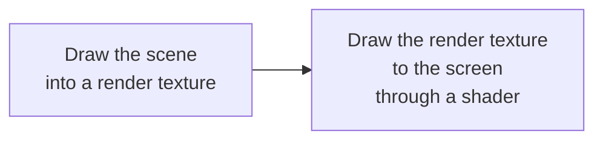
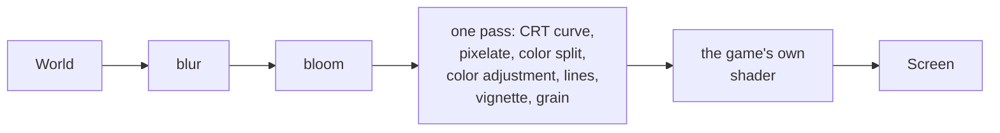

# Post-processing {#post_processing}

Post-processing applies a shader to the **whole frame** after everything has been drawn: blur, CRT,
vignette, color changes...

The commonly used effects are already built in, no shader needed: see
[Built-in effects](#post_builtin) at the end of the page. The first part of the page is for when you want to
write your own shader.

The principle:



A render texture is an off-screen image. You draw the scene into it, then draw it to the
screen with a shader turned on. The shader runs on every pixel of the whole scene.

The built-in shaders are compiled **when the game starts**, not the first time an effect is turned on,
so opening a pause menu with `blur` does not stall a frame. A `blur` of 3 pixels or more runs at half
resolution (touching only a quarter of the pixels) and is scaled back up; smaller ones run at full resolution.

## Example

@include post_processing.cpp

Two steps in two different phases:

| Step | Phase | Why |
|---|---|---|
| Draw the scene into the render texture | `phase_post_update` | njin::render_texture_begin() resets the camera's transform, so it must not be called while the camera is on |
| Draw the render texture to the screen | `phase_post_render` | This is screen space, with no camera, so the image covers exactly the whole window |

## The functions

| Function | What it does |
|---|---|
| njin::render_texture_load() | Creates a render texture of a given size |
| njin::render_texture_begin() | Starts drawing into it. There is a version that also takes a color to clear with first |
| njin::render_texture_end() | Stops drawing into it |
| njin::render_texture_draw() | Draws its contents out, the right way up |
| njin::render_texture_size() | Size (pixels) |
| njin::render_texture_unload() | Frees it |

The size is usually njin::screen_size(). If you resize the window, create the
render texture again.

## Post-processing for the whole world through the camera

The method above applies post-processing to things **you draw into the render texture yourself**. To apply it to the **whole
world** the camera draws (sprites, tilemaps, everything in `phase_render`), you only need one
line:

```cpp
njin::camera_set_post_shader(ctx, effect);         // on
njin::camera_set_post_shader(ctx, njin::shader_handle{}); // off
```

The engine draws the world into an off-screen image the size of the window (recreated automatically when the
window is resized), then draws that image to the screen through the shader. The UI in `phase_post_render`
is drawn afterwards, so it is not affected. Set uniforms as usual with the
`shader_set_*()` functions.

A post-processing shader can also read extra images (palettes, noise) and uniform arrays (a list of lights): see @ref shader_advanced,
which has examples of night with lights, dusk with a palette, and fog with noise.

## Built-in effects {#post_builtin}

njin::post_fx_set() turns on the built-in effects over the whole world, no shader needed.
Like the shader above, they do not touch the UI in `phase_post_render`.

@include post_builtin.cpp

| Effect | Fields | Off when |
|---|---|---|
| Color adjustment | `brightness`, `contrast`, `saturation`, `sepia`, `tint` | 0, 1, 1, 0, white |
| Vignette (dark edges) | `vignette`, `vignette_radius`, `vignette_softness`, `vignette_color` | `vignette` = 0 |
| Bloom (glow) | `bloom`, `bloom_threshold`, `bloom_radius` | `bloom` = 0 |
| Blur | `blur` (pixels) | 0 |
| Color split | `chromatic` (pixels) | 0 |
| CRT scanlines | `scanlines`, `scanline_size` | `scanlines` = 0 |
| CRT curvature | `crt_curve` | 0 |
| Pixelate | `pixelate` (cell size, pixels) | below 2 |
| Film grain | `grain` | 0 |

The images below are captured from `njin_render_demo`: no post-processing, then CRT (key 6), bloom (key 5) and blur (key 4) turned on. Bloom only shows where there are bright areas, so its image combines two versions (off and on) of a scene with glowing particles.

@image html render_demo.png "No post-processing"

@image html render_demo_crt.png "CRT (key 6): horizontal lines and a curved screen at the edges"

@image html render_demo_bloom.png "Bloom (key 5), same scene: off on the left, on on the right. Bright areas glow outward, most visible in the cluster of yellow particles at the bottom right, and the blue halo around the fountain is wider"

@image html render_demo_blur.png "Blur: blurs the whole scene"

The ready-made set is in `namespace njin::post`: njin::post::crt(), njin::post::noir(),
njin::post::vintage(), njin::post::dream(), njin::post::glow(), njin::post::retro(),
njin::post::hurt(), njin::post::paused().

The order they are applied in:



Bloom and blur cost a few extra full-screen passes; the remaining effects are merged into a single pass
so they are almost free. Every field can be changed each frame: njin::post_fx_lerp() helps transition smoothly
between two sets.
