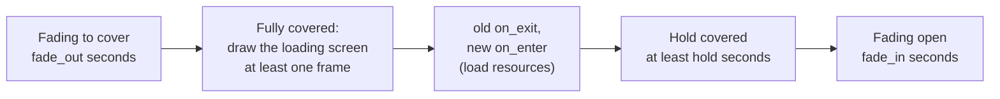

# Scenes {#scenes}

A scene is a large state of the game: menu, playing, pause, game over. Only one scene runs
at a time.

@include scenes.cpp

## Three things scenes do for you

**1. Systems that run only in one scene.** Set `scene` in njin::sys_desc. A system with
no scene set (handle id 0) runs in every scene.

**2. Functions called on entering and leaving a scene.** `on_enter` and `on_exit` in njin::scene_desc, each
function running exactly once per transition. This is where you create the level's world and save the score.

**3. Automatic cleanup of the scene's entities.** Attach njin::scene_owned to an entity; when that scene is left, the engine
destroys it. You do not have to clean up yourself.

## Switching scenes

njin::scene_set() **does not switch immediately** but at the **start of the next frame**, before every system of
that frame. The current frame therefore runs fully inside one scene.

When switching, the engine does the following in order:

1. calls the old scene's `on_exit`,
2. destroys every entity whose njin::scene_owned points to the old scene,
3. calls the new scene's `on_enter`.

The first scene is also set with njin::scene_set(), usually in `phase_startup`. Before
that there is no scene: only systems not tied to a scene run.

| Function | What it does |
|---|---|
| njin::scene_register() | Create a scene. If the name already exists, returns the old scene |
| njin::scene_find() | Find a scene by name |
| njin::scene_set() | Switch scene at the start of the next frame |
| njin::scene_current() | The scene that is running |

## Fade transitions

njin::scene_fade() changes scene after a fade effect, and can show a loading screen:

@include scene_fade.cpp

- The loading screen (`draw_loading`) is drawn **before** the new scene's `on_enter` runs, so if
  `on_enter` loads heavy resources the player still sees it, and does not see a frozen window.
- Time is measured in real time: pause and time_set_scale() have no effect.
- The game keeps running during the transition. Use njin::scene_transitioning() to skip input if needed.
- Calling njin::scene_fade() again during a transition only changes the target scene. Calling njin::scene_set() during a
  transition cancels the effect and switches on the next frame.
- The overlay sits on top of everything, UI included.

| Function | What it does |
|---|---|
| njin::scene_fade() | Switch scene with a fade effect |
| njin::scene_transitioning() | Whether a transition is in progress |
| njin::scene_transition_cover() | The current coverage, 0..1 |

## Scene or pause?

A pause menu usually should **not** be its own scene: switching scenes would destroy the world being
played. Keep the "play" scene and use njin::time_set_paused() (see @ref time), then draw the menu
while it is stopped. The Pong game in `src/games/pong` does it this way.
