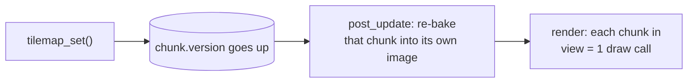

# Tilemap {#tilemap}

A tilemap is a grid of square tiles drawn from a **tileset** (one image made of equally sized tiles). Use it
for platformer maps, RPGs, digging worlds.

@include tilemap.cpp

## Creating a tilemap

Attach njin::transform and njin::tilemap to an entity. `transform.pos` is the top-left corner
of tile (0, 0) in the world.

- `tileset`, `tile_size`: the image and the size of one tile.
- Each cell holds the **tile's index in the tileset** (from 0, row by row), or **-1** for an empty cell.
- Change a cell with njin::tilemap_set(), read it with njin::tilemap_get().
- `layer`, `tint`, `visible` work like on a sprite.

A tilemap has **no fixed size** and cell coordinates can be negative: set a cell anywhere and the map
grows to reach it.

## Writing the map as text

Don't want to use Tiled or LDtk? Write the map the old-school way: each character is one tile.
njin::tilemap_from_text() reads a multi-line string (written right in the code, or read from a text file with
njin::file_read()), while njin::tilemap_from_rows() takes each row separately for small maps.

@include tilemap_text.cpp

The third parameter is the **character table** (njin::tile_key): which character sets which tile number. In the example above `#` is tile 7 (stone wall) and `.` is tile 0
(grass). A character that is not in the table has two cases:

- ` `, `.` and tab are **empty cells**;
- every other character is a **marker**: the function sets no tile, but returns its position in a
  njin::tile_marker list (in reading order, top to bottom and left to right). This is where you put the player's spawn
  point (`P`), enemies (`E`), coins, doors... Create the entity at exactly that cell yourself; njin::tilemap_cell_rect() turns a cell
  into a position in the world.

A character can both set a tile and be reported: `{'P', 0, true}` sets grass tile 0 under the character's feet **and** reports the position of `P`,
so there is no hole under the player.

| Rule | Details |
|---|---|
| Position | The first line is row 0, the first character is column 0, plus the `origin` parameter if given. Rows of different lengths are fine |
| First line of the string | If the string starts with a newline, that newline is dropped, so you can write `R"(` then a new line and then the first row. A last line ending in a newline does not add an empty row |
| Windows line endings | `\r\n` is understood correctly, with no stray `\r` character |
| Layering | Empty cells and markers **do not touch** a cell that already exists, so call it several times for several layers (ground, then decorations). To erase a cell, say so explicitly in the table: `{'x', -1}` |
| Collision shapes | Characters in the table call njin::tilemap_set(), so njin::tilemap_set_shape() and njin::tilemap_animate() apply as usual |

@note A text map only builds **tiles** and reports positions. It creates no entities, and has no properties or objects
like Tiled/LDtk (see @ref level). If you want those, read the njin::tile_marker list and create entities, or
use njin::prefab_spawn() (@ref prefabs) for each character. To save the map to a file, write out the text string itself.

## Chunking

Tiles are stored and drawn by **chunk**: blocks of 32 x 32 tiles (njin::tile_chunk_size).

**Sparse storage.** Only chunks with at least one tile exist. A map thousands of tiles wide
but sparse is still light. Clear all of a chunk's tiles and the chunk is removed.

**Pre-drawing (bake).** Each chunk is drawn once into its own image. Every frame, a chunk costs
**one draw call** instead of 1024 calls for each tile. A chunk is only redrawn when a tile changes: each
chunk has a `version` number that goes up every time njin::tilemap_set() changes it.

**Only draw what is visible.** Only chunks inside the camera's view
(njin::camera_bounds()) are baked and drawn.

**Freeing.** The image of a chunk that has been off-screen for about 5 seconds (300 frames) is
freed, and re-baked when you come back. The images of chunks or tilemaps that were destroyed are
freed on the next frame.

**Changing tiles after baking.** A chunk that just changed this frame (for example in `phase_render`) is
drawn tile by tile once to be correct, then re-baked on the next frame. A stale image is never shown.

@warning Always change tiles with njin::tilemap_set(). If you edit `tilemap::chunks` directly, the engine does not
know which chunk needs redrawing.

## Collision with the tilemap

Every non-empty tile is an obstacle.

| Function | What it does |
|---|---|
| njin::tilemap_cell_at() | The cell containing a point in the world |
| njin::tilemap_cell_rect() | The rectangle of a cell in the world |
| njin::tilemap_overlaps() | Whether a rectangle touches any cell |
| njin::tilemap_move() | Moves a rectangle, stopping when it hits a cell |

njin::tilemap_move() goes along the **horizontal axis first and then the vertical axis**, so the character slides along
walls instead of sticking to them. `hit_y && delta.y > 0` means it is standing on the ground.

If you need collision with both the tilemap and other entities (crates, doors, monsters), attach a `collider_tiles`
collider to the tilemap and use njin::collision_move(), see @ref collision.

@note On each call, each axis should move no more than one tile. An object that moves too fast can pass through
a thin wall. Put physics in `phase_fixed_update` so steps are small and even (see @ref time).

## Collision shapes and tile animation

Each kind of tile can have its own **collision shape** (one-way platform, slope, no collision) and **animation** (water,
torches). Both are set by tile index, so they apply to every tile of the same kind:

@code
njin::tilemap_set_shape(map, 3, njin::tile_one_way);
njin::tilemap_set_shape(map, 4, njin::tile_slope_r);
njin::tilemap_animate(map, 10, {10, 11, 12, 13}, 0.18f); // tile 10 plays through four frames
@endcode

Maps loaded from Tiled and LDtk come with both (see @ref level). An animated tile is not baked into the chunk image
but drawn on top every frame, so static chunks stay cheap. `collision_move()` and `collision_raycast()`
understand tile shapes; tilemap_move() treats every tile as an obstacle. See @ref platformer to use them.
