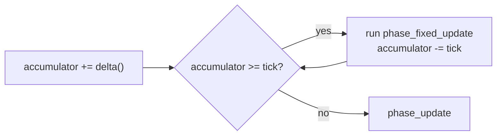

# Time, fixed update, timers and tweens {#time}

## The kinds of time

| Function | Returns | Affected by speed and pause |
|---|---|---|
| njin::delta() | The frame's time (seconds) | Yes |
| njin::delta_real() | The frame's real time | No |
| njin::elapsed() | Time since the game opened | No |
| njin::fixed_delta() | The length of one fixed tick | Never changes |

Most code uses njin::delta(). Use njin::delta_real() for things that must keep running while the game
is stopped: the pause menu, UI effects.

## Speed and pause

- njin::time_set_scale(): 1 is normal, 0.5 is half speed. It affects delta(), fixed
  update and sprite animation. Use it for slow motion.
- njin::time_set_paused(): njin::delta() goes to 0 and fixed update stops. **Every other phase still
  runs**, so input can still be read and menus can still be drawn.

## Fixed update

`phase_fixed_update` runs at a **fixed tick**, 60 times per second by default
(`njin_cfg::fixed_hz`). Each frame it runs 0, 1 or a few times depending on FPS, so that the total number of ticks
matches real time.



In this phase, njin::delta() returns **exactly one tick**. Put **physics** here: the result is the same
whether the machine runs at 30 or 144 FPS, and collisions do not tunnel through when FPS drops.

If a frame is very long (for example stopped at a breakpoint), the remainder beyond 8 ticks is dropped, so the game
does not have to run hundreds of ticks at once.

njin::fixed_alpha() tells you the leftover part of a tick (0..1). Use it to interpolate the position when drawing, for
smooth motion when FPS is higher than the physics tick:

```cpp
const njin::vec2 draw_pos = njin::lerp(prev_pos, pos, njin::fixed_alpha(ctx));
```

## Timers and tweens

@include time_tween.cpp

njin::timer counts down and then reports. `tick(dt)` returns `true` exactly once when time is up (or every
loop if `repeat`). `progress()` gives progress 0..1.

njin::tween smoothly moves a value (`f32`, `vec2` or `rgba`) from `from` to `to` over
`duration` seconds, along an njin::ease curve. `tick(dt)` returns the current value.

| Curve | Feel |
|---|---|
| `linear` | Even, mechanical |
| `out_quad`, `out_cubic` | Slows down on arrival: the most natural for UI |
| `in_out_sine` | Soft at both ends: camera moves |
| `out_back` | Overshoots then returns: a panel popping out |
| `out_bounce` | Bounces like a dropped ball |
| `out_elastic` | Wobbles like a spring |

Timers and tweens are plain structs, not components. You decide where to keep them: in a
component, in a module's variables.
