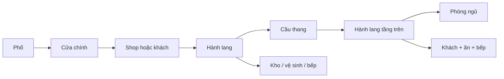

# Rule procedural building cho game

Đọc `building_rules.json` để lấy tham số, `building_plan.schema.json` để biết
cấu trúc đầu ra, và `examples/*.plan.json` để xem bố cục đã đo. Đây là dữ liệu
thiết kế cho gameplay; các giá trị có thể tinh chỉnh theo actor và camera.
Gói này chưa thay `city/gen_buildings.cpp`, `city/interior.cpp` hoặc renderer.
`building_request.schema.json` và `examples/*.request.json` là đầu vào mẫu:
seed, archetype, parcel, các mặt phố, kích thước, số tầng và capability cần có.
Các interval `[min,max]` trong rule là range đóng; chọn số bay/số tầng nguyên.

`building_rules.json.runtime_rule_packs` liên kết rule phân bố 25 đạo cụ và
`shutter_behavior.json`. Cánh chớp đổi ngẫu nhiên theo giờ game, tối thiểu 8 giờ
giữa hai lần đổi và tối đa 2 lần/ngày; không roll mỗi frame. Xem
`../../../street_retro/RULES.vi.md` và script tham khảo `tools/retro_rule_reference.py`.
Các rule runtime này chưa được nối vào C++.

## Hợp đồng đơn vị và tọa độ

Rule dùng **mét**, diện tích dùng m², góc trong plan dùng radian. Gốc ở góc
trước trái footprint: X ngang mặt tiền, Y từ trước ra sau, Z lên. Bay 2 m,
tầng 3 m, tường ngoài 0.2 m, vách trong 0.12 m, sàn 0.2 m. Phòng dùng polygon
diện tích thực; phần bo, sân trong, shaft và cầu thang không tính vào phòng.

Trong code hiện tại `city/city.h::units_per_metre = 6`; `view.h::unit3d = 1/32`.
Với building có width W, depth D theo mét:

```cpp
table = b.box.center
      + b.box.axis_x() * ((local_x - W/2) * units_per_metre)
      + b.box.axis_y() * ((local_y - D/2) * units_per_metre);
render = to3d(table, local_z * units_per_metre * unit3d);
```

`to3d` tự nhân X/Y bảng với `unit3d`, nhưng chiều cao truyền vào đã là đơn vị
render. Đừng nhân 1/32 thêm lần nữa. `b.box.angle` dùng **độ**, còn chiều cao
3 m là 18 world unit hoặc 0.5625 render unit. Header `cpp_contract.hpp` có
helper thuần C++ và các kiểu dữ liệu cốt lõi; chưa có JSON loader.

Lưới nội thất cũ có `interior_cell=22`, khoảng 3.667 m theo tỷ lệ hiện tại;
ô phòng 4 m mới tương ứng 24 world unit. `kit_unit=5.5` của interior kit cũ
phải giữ như adapter riêng. Không đổi tỷ lệ asset cũ chỉ bằng cách thay số 22.

## Diện mạo

Chọn một style cho toàn nhà: Indochine / Modern / Brick, theo trọng số từng
district. Chọn palette đồng bộ, roof và nhịp mặt đứng trước khi thêm chi tiết.
Random riêng từng stream: appearance không được làm đổi vị trí phòng hoặc
cầu thang. `sub_seed` trong header khớp hàm `mix` đang có trong game.

Mặt phố có shopfront ở tầng trệt; mặt hậu giáp nhà khác dùng tường kín.
Cửa sổ trước hết phục vụ phòng cần sáng, sau đó mới dùng mật độ random để
trang trí bay còn lại. Các tầng giữ hàng bay thẳng nhau. Ban công dùng cửa
ra ban công lớn và sàn ngang cao độ tầng; không thay bằng cửa sổ có bậu.
Mái hiên bám tường và cao hơn lỗ shop ít nhất 0.06 m; sọc mái theo pháp tuyến
mái. Mỗi bay tối đa một chi tiết chính và hai chi tiết phụ.

Nhà ba mặt phố là nam + đông + tây; nhà góc bo là nam + cung bo + đông.
Với góc bo, đặt cửa chính phẳng theo tiếp tuyến giữa cung. Ghép R4/A30 bằng
3 mảnh cho góc 90°, hoặc R2/A45 bằng 2 mảnh. Không trộn bán kính/góc tại một
mối nối. Dùng `right` và `right_tangent_degrees` trong manifest của kit.

## Không gian rộng rãi

| Thành phần | Tối thiểu | Mục tiêu phổ biến |
|---|---:|---:|
| Phòng khách | 18 m² | 26 m² |
| Khách + ăn + bếp mở | 22 m² | 32 m² |
| Phòng ngủ | 12 m², rộng 2.8 m | 18 m² |
| Bếp riêng | 9 m² | 14 m² |
| Vệ sinh | 4 m² | 6 m² |
| Shop | 24 m² | 40 m² |
| Hành lang spacious | 1.4 m | 1.6 m |
| Lối qua cửa trong | 0.9 m thông thủy | 1.05 m aperture |
| Cầu thang | 1.2 m bề rộng | chiếu nghỉ 1.4 m |

Actor mặc định bán kính 0.3 m; cộng 0.1 m cách tường. Hai actor tránh nhau
cần 1.4 m. Nội thất chiếm tối đa 25% diện tích phòng trong preset spacious;
lõi thang/hành lang không đặt đồ. Không đặt vật trong quỹ đạo mở cửa hoặc
vùng 0.35 m sát portal. Độ sáng mục tiêu: diện tích kính ít nhất 8% diện tích
phòng cho khách/ngủ/bếp/office; bathroom và kho có thể dùng shaft/ventilation.

Các minimum là hard constraint, target là điểm ưu tiên. Nếu thiếu diện tích,
giảm số phòng tùy chọn hoặc trả `NoFit`; không âm thầm thu hẹp lối đi. Profile
townhouse có thể không fit spacious trên một số lô hẹp. Các sample Blender
8×8 m ban đầu là ngoại thất; ví dụ nội thất rộng rãi ở đây dùng **12×10 m**.

## Bố cục kiến trúc

Phân vùng: mặt phố public (shop/khách), giữa nhà circulation, hậu và tầng trên
private/service. Tránh đi qua phòng ngủ để sang phòng khác. Bathroom không
mở trực tiếp vào bếp. Chồng bathroom/shaft cùng vị trí giữa các tầng; sai lệch
tối đa 0.1 m. Cầu thang giữ cùng core, trừ tầng cao nhất không có thang đi lên.



Nếu bật `independent_access` cho shop house, thêm một cửa riêng tới core để
người ở nhà không phải qua shop lúc shop đóng. Default example có một cửa
chính chung; tùy chọn này phải giải lại room graph và opening schedule.

Cầu thang thẳng của kit có 15 bậc × 0.2 m, chạy 3.75 m; cộng hai chiếu nghỉ
1.4 m thì core dài ít nhất 6.55 m. Ví dụ dùng dogleg chia 8 + 7 bậc, core
2.88×5.24 m, hai vế rộng 1.2 m và khe 0.2 m. **Dogleg là geometry cần sinh
trong runtime**, không có asset trong kit hiện tại. Đục void trong sàn tầng
trên theo `slab_voids_m`; giữ vùng landing. Đo khoảng trống trên đường đi
thang ít nhất 2.2 m; đừng chỉ đặt một model thang vào sàn kín.

Footprint Courtyard/U/T mặc định Blender có các cánh 1 bay, thường quá hẹp
cho nội thất spacious. Rule mới yêu cầu cánh ít nhất 2 bay và phần clear
rộng tối thiểu 3.2 m: dùng custom tiles/polygon thay vì lặp trực tiếp preset cũ.

## Quy trình sinh để đưa vào code

1. Chọn archetype theo zoning, mặt phố và kích thước parcel. Trừ setback.
2. Tách sub-seed theo các salt trong rule; lưu rule_version + seed + archetype.
3. Sinh footprint polygon và holes; snap footprint theo bay 2 m.
4. Offset tường ngoài vào 0.2 m; reserve sân trong, core, shaft và slab void.
5. Tính area budget: room minima + core + circulation + partitions. Reject sớm
   nếu vượt diện tích; không để bước facade quyết định cách chia phòng.
6. Giải room graph rồi polygon partition theo lưới 0.5 m, giữ chiều rộng clear.
7. Đặt portal trên giao diện thực giữa hai phòng; thêm vertical link tại thang.
8. Gán aperture ngoài tới room cần sáng. Portal và window dùng cùng dữ liệu
   cho ngoại thất, cutaway, collision và nav; cửa ra ban công có destination.
9. Ghép một shell hàn kín mỗi tầng, Boolean aperture một lần. Thêm dressing
   từ module chuẩn, không chồng substrate/floor_band. Clone rig và Action cửa;
   mesh có thể dùng chung. Không scale rig cửa khác tỷ lệ theo từng trục.
10. Sinh vách trong, cửa trong, trần/sàn có void, stair và props. Kiểm tra
    polygon overlap, headroom, toàn bộ door sweep, và nav đã erode theo actor.
11. Chấm điểm target area/daylight/routes/rhythm; giữ phương án hợp lệ tốt nhất.
    Tối đa 32 lần thử; hết lượt trả `NoFit` với rule vi phạm.

Một room graph liên thông chưa chứng minh actor đi qua được. Runtime phải
chạy BFS/A* trên vùng walkable thật sau khi trừ collision và door state.
Portal bị khóa không được coi là liên kết luôn mở. Renderer và physics phải
đọc cùng `BuildingPlan`, không random lại layout khi vẽ/cutaway.

## Nối với cấu trúc game hiện tại

- `building::box` tiếp tục dùng broadphase/LOD, thêm footprint polygon + holes
  và một plan ID/cache. OBB chứa hình bo không thay thế collision polygon.
- `building::look` là base seed; archetype mới có thể tạm gắn `tube_house`,
  `house`, `apartment` rồi lưu metadata riêng, không cần đổi enum tức thì.
- `interior_layout` cần room polygon, portal thật, shaft/void và stair links.
  Lưới nx×nz hiện tại chỉ nên là projection/debug; hình bo không lấp đầy OBB.
- Thêm map cho living_dining_kitchen → living, storage → hall_storage,
  utility → kitchen hoặc mở rộng room_kind. Map cũ không chứa đầy semantics.
- `render_kit.cpp` hiện dùng kit Quaternius và bốn cạnh hộp. Cần importer/export
  riêng cho 105 asset PBK và nhánh mặt bo; rules không tự nạp `.blend` vào game.
- Frame 1–96 của Blender là clip preview cửa. Gameplay điều khiển open_amount
  theo thời gian/interaction và cập nhật swept collision; đừng auto-loop mọi
  cửa trong game.

## Ví dụ và kiểm tra

Ba plan JSON gồm nhà riêng rộng, shop house ba mặt phố và shop house bo R4,
mỗi plan hai tầng. Room polygon, portal, daylight binding, stair walking line
và slab void đều có tọa độ theo mét. Xem `layout_examples.png`.

`appearance.palettes` chứa màu wall/trim/frame/roof theo linear RGBA, lấy trực
tiếp từ palette của kit Blender. Khi hiển thị màu trong UI sRGB, đổi color
space trước; không áp gamma lần nữa nếu renderer đã đọc màu tuyến tính.

`tools/validate_building_rules.py` kiểm tra schema đã dùng, ID asset, diện tích,
room overlap/containment, graph, aperture tới phòng và các tham số stair. Có
negative cases cho phòng thiếu lối ra, room overlap và ID module sai. Đây là
kiểm tra hợp đồng dữ liệu; runtime nav/door-sweep và mesh headroom vẫn phải
được chạy khi tích hợp geometry thực. Báo cáo ghi rõ phạm vi.
Semantic validator này dành cho ba fixture hai tầng, footprint lồi và cầu
thang dogleg; các dạng courtyard, một tầng hoặc stair khác cần bộ kiểm tra
polygon/void tổng quát trong runtime.

Chạy lại bằng Python có Pillow để vẽ diagram:

```text
python tools/make_building_rules.py
python tools/validate_building_rules.py
```
